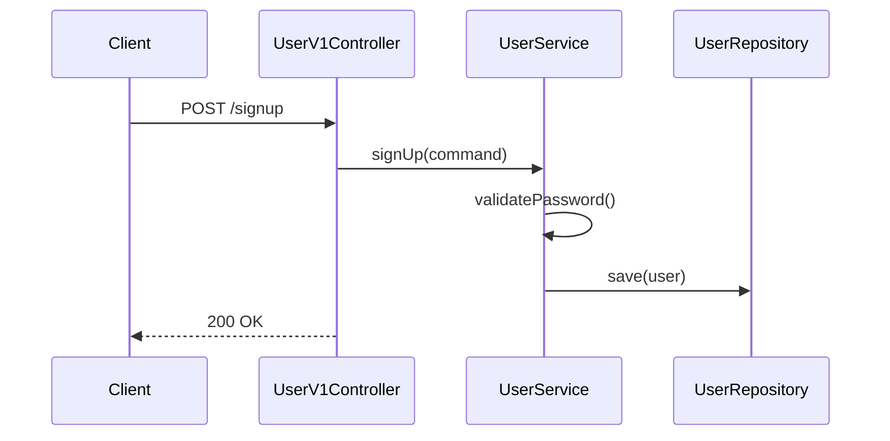
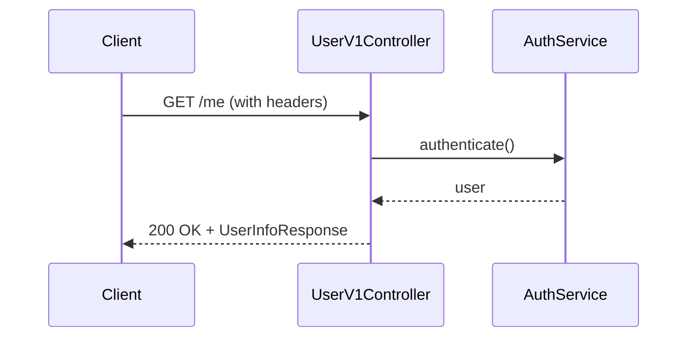
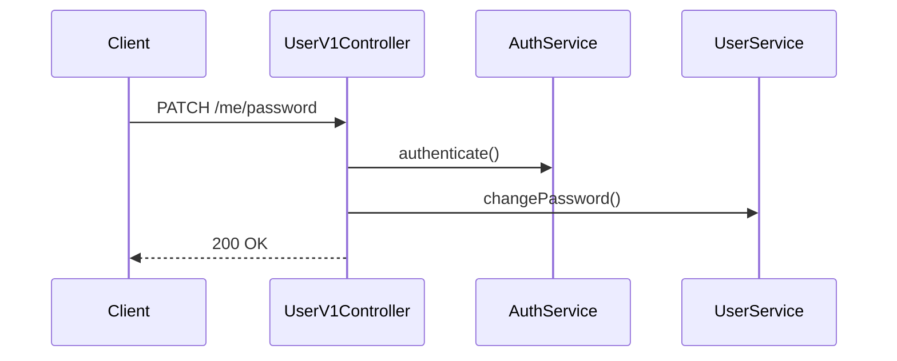

## 📌 Summary

- **배경**: Round 1 Quest - 회원가입, 내 정보 조회, 비밀번호 변경 API 구현 필요
- **목표**: TDD(Red → Green → Refactor) 방식으로 단위 테스트 + 통합 테스트 + E2E 테스트 기반 User API 개발
- **결과**: 총 44개 테스트 통과 (단위 23개 + 통합 8개 + E2E 13개), 3개 API 엔드포인트 구현, Swagger 문서화 완료


## 🧭 Context & Decision

### 문제 정의
- **배경**: 커머스 서비스에서 회원 관리 기능이 필요하나 현재 User API 없음
- **현재 제약**: 헤더 기반(`X-Loopers-LoginId/Pw`) 간이 인증만 존재 (실제 회원 데이터 없음)
- **목표**: 회원가입, 내 정보 조회, 비밀번호 변경 API 구현 + TDD 방식 적용
- **개발 방식**: Claude Code를 활용한 AI 페어 프로그래밍
- **성공 기준**: 44개 테스트 통과 + Swagger 문서화 완료

---

### 선택지와 결정

#### 1. TDD Red 단계: 컴파일 에러 vs 기능적 실패

**고민**: Unit Test를 먼저 작성하니 구현체가 없어서 **컴파일 에러** 발생. "이게 진짜 실패하는 테스트인가?"

```kotlin
// Red 단계 - 컴파일 에러 상태
@Test
fun createsUser_whenValidInfoProvided() {
    val command = SignUpCommand(...)  // ❌ 클래스 없음
    val result = userService.signUp(command)  // ❌ 메서드 없음
    assertThat(result.loginId).isEqualTo("testuser1")
}
```

**결론**: 컴파일 에러도 실패다. 테스트가 **설계 문서 역할**을 하므로 먼저 작성하는 것이 의미 있음.

```kotlin
// 테스트가 요구사항 명세서 역할
@DisplayName("비밀번호가 8자 미만이면, BAD_REQUEST 예외가 발생한다.")
@DisplayName("비밀번호에 생년월일이 포함되면, BAD_REQUEST 예외가 발생한다.")
// → 이 테스트들을 통과시키면 요구사항 충족!
```

**진행 방식**:
1. 테스트 먼저 작성 (컴파일 에러)
2. 최소 구현체 생성 → `throw NotImplementedError()` (기능적 실패 확인)
3. 실제 로직 구현 (Green)

**Claude와 함께하는 TDD**:
- **Red 단계**: Claude가 다양한 테스트 케이스(경계값, 예외) 생성 → 휴먼이 적절한 것 선별
- **Green/Refactor 단계**: 테스트가 깨지지 않도록 Claude가 안전하게 구현/수정

---

#### 2. 단위 테스트에서 테스트 더블 선택

**고민**: `UserService`를 테스트할 때 `UserRepository`와 `PasswordEncoder`가 필요한데, 어떻게 처리할지?

**대표적인 테스트 더블 종류**:
- Stub | 미리 정해진 값을 반환
- Mock | 호출 여부/횟수 검증 (`verify()`)
- Fake | 실제 동작하는 가짜 구현체 (예: 인메모리 DB)

**선택지**:
- A: 실제 DB 사용 → 통합 테스트처럼 동작
- B: 테스트 더블 사용 → 순수하게 `UserService` 로직만 테스트

**결론**: Mockito의 `@Mock` 사용 (실제로는 **Stub 용도**)

```kotlin
// Stub - 미리 정해진 값 반환 (사용한 방식)
whenever(userRepository.existsByLoginId("testuser1")).thenReturn(false)
whenever(userRepository.save(any())).thenAnswer { it.arguments[0] }

// Mock - 호출 검증 (사용 안함)
verify(userRepository).save(any())
```

**왜 verify()를 사용하지 않았나?**
- `signUp()`이 `User`를 **반환**하므로, 반환값으로 검증 가능
- `verify()`는 **void 반환** 또는 **부수 효과** 검증 시 필요

```kotlin
// 반환값으로 검증 가능 → verify() 불필요
val result = userService.signUp(command)
assertThat(result.loginId).isEqualTo("testuser1")
```

**verify()가 필요한 경우 (추후 확장 시)**:
```kotlin
// 회원가입 후 이메일 발송, MSA에서 다른 서비스 호출 시
emailService.sendWelcomeEmail(user.email)  // void 반환
userEventPublisher.publish(UserCreatedEvent(...))  // 이벤트 발행

// 반환값으로 확인 불가 → verify() 필요
verify(emailService).sendWelcomeEmail("test@example.com")
verify(userEventPublisher).publish(any())
```

| 상황 | 검증 방법 |
|-----|----------|
| 반환값 있음 | `assertThat(result)...` |
| void / 외부 API / MSA 호출 | `verify()` |

---

#### 3. Facade 패턴 적용 여부

**고민**: Controller에서 `UserService`와 `AuthService` 두 개 주입받는데, Facade로 묶어야 하나?

```kotlin
class UserV1Controller(
    private val userService: UserService,
    private val authService: AuthService,
)
```

**결론**: Facade 미적용
- 둘 다 **같은 User 도메인** 내 서비스
- Facade는 **서로 다른 도메인**(예: Order + User) 조합 시 사용
- JWT/OAuth 추가 시 Auth가 별도 도메인으로 분리되면 그때 Facade 고려 → `TokenService` 분리 또는 `AuthService` 신규 생성

---

#### 4. 회원가입 응답 설계

**고민**: `{ id, loginId }` 반환 vs 아무것도 반환 안함

**결론**: 아무것도 반환하지 않음
- 클라이언트가 즉시 사용할 데이터 없음
- 필요시 "내 정보 조회" API 호출

```kotlin
@PostMapping("/signup")
fun signUp(@RequestBody request: UserV1Dto.SignUpRequest): ApiResponse<Any> {
    userService.signUp(request.toCommand())
    return ApiResponse.success()  // data 없이 성공만 반환
}
```

---

#### 5. 프로젝트 구조 - 헥사고날 아키텍처?

**고민**: 현재 구조가 헥사고날인지 레이어드인지?

```
com.loopers/
├── interfaces/     # Controller, DTO (외부 요청 처리)
├── domain/         # Entity, Service, Repository 인터페이스
└── infrastructure/ # Repository 구현체, 외부 시스템 연동
```

**왜 헥사고날이라고 생각했나?**
- `domain`에 `UserRepository` **인터페이스** 정의
- `infrastructure`에 `UserRepositoryImpl` **구현체** 분리
- `PasswordEncoder` 인터페이스도 domain에, `BcryptPasswordEncoder` 구현체는 infrastructure에

```kotlin
// domain/user/UserRepository.kt - 인터페이스
interface UserRepository {
    fun save(user: User): User
    fun findByLoginId(loginId: String): User?
}

// infrastructure/user/UserRepositoryImpl.kt - 구현체
@Component
class UserRepositoryImpl(
    private val userJpaRepository: UserJpaRepository,
) : UserRepository { ... }
```

**헥사고날 아키텍처란?**
- **핵심 아이디어**: 도메인(비즈니스 로직)이 외부 기술(DB, HTTP, 메시징)에 의존하지 않음
- **Port**: 도메인이 정의한 인터페이스 (예: `UserRepository`)
- **Adapter**: Port 구현체 (예: `UserRepositoryImpl` - JPA 사용)
- **장점**: DB를 MySQL → MongoDB로 바꿔도 도메인 코드 수정 불필요

**결론**: 현재는 **헥사고날 스타일의 레이어드 아키텍처**
- 인터페이스/구현체 분리는 헥사고날 **요소를 차용**
- 하지만 Input/Output Port 명시적 구분, Use Case 분리 등 **순수 헥사고날은 아님**
- 현재 규모에서는 이 정도가 적절 (과한 추상화는 오버엔지니어링)

**왜 헥사고날을 지향하는가?**
- **테스트 용이성**: 인터페이스 기반이라 Mock 교체 쉬움
- **기술 변경 유연성**: JPA → 다른 ORM 변경 시 infrastructure만 수정
- **도메인 보호**: 비즈니스 로직이 프레임워크에 오염되지 않음

---

#### 6. Testable한 코드란?

TDD를 진행하면서 느낀 점:
1. **의존성 주입(DI)**: Mock으로 교체 가능해야 함
2. **단일 책임**: 하나의 메서드가 하나의 일만
3. **검증 로직 분리**: `validatePassword()` 같은 메서드 분리 → 단위 테스트 용이

```kotlin
class UserService {
    fun signUp(command: SignUpCommand): User {
        validateLoginIdNotDuplicated(command.loginId)  // 테스트 가능
        validatePassword(command.password, ...)         // 테스트 가능
        return userRepository.save(...)
    }
}
```


## 🏗️ Design Overview

### 변경 범위
- **신규 추가**: User API 3개, 단위 테스트 23개, 통합 테스트 8개, E2E 테스트 13개, Swagger 어노테이션

### 주요 컴포넌트 책임

| 컴포넌트 | 책임 |
|---------|------|
| `UserV1Controller` | HTTP 요청/응답, Swagger 문서화 |
| `UserService` | 회원 CRUD, 비밀번호 검증 |
| `AuthService` | 인증 로직 (헤더 기반 로그인 검증) |
| `User` | 엔티티, 기본 검증 (loginId/이메일 형식), 이름 마스킹 |

### 테스트 현황

| 테스트 파일 | 개수 | 유형 | 대상 |
|------------|------|------|------|
| `UserTest.kt` | 8개 | 단위 | 엔티티 생성 검증, 이름 마스킹 |
| `UserServiceTest.kt` | 12개 | 단위 | 회원가입, 내 정보 조회, 비밀번호 변경 |
| `AuthServiceTest.kt` | 3개 | 단위 | 인증 로직 |
| `UserServiceIntegrationTest.kt` | 8개 | 통합 | Service + Repository 실제 DB 연동 |
| `UserV1ApiE2ETest.kt` | 13개 | E2E | API 전체 흐름 |
| **합계** | **44개** | | |


## 🔁 Flow Diagram

### 회원가입


### 내 정보 조회


### 비밀번호 변경



