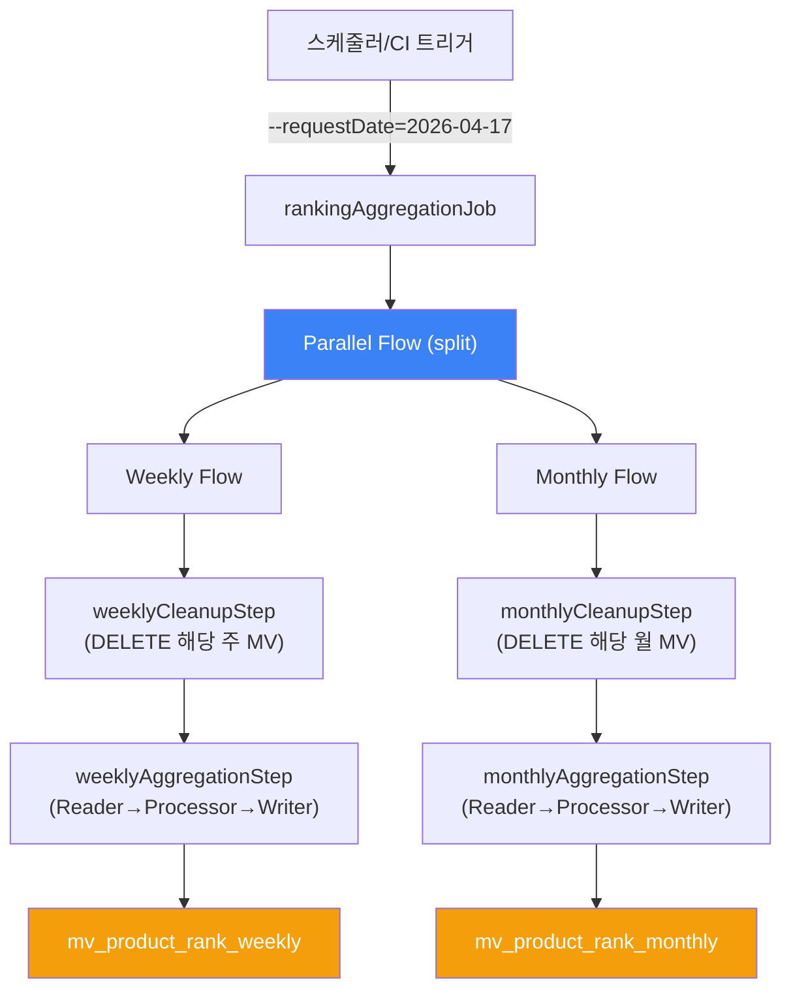
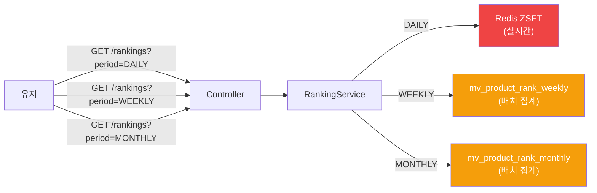

## 📌 Summary

- **배경**: 9주차에서 구축한 실시간 일간 랭킹(Redis ZSET)은 당일 데이터만 반영하여, 주간/월간 트렌드를 파악할 수 없음
- **목표**: Spring Batch로 ranking_event_log의 일별 이벤트 데이터를 주간/월간 단위로 집계하고, Materialized View 테이블에 Top 100 랭킹을 사전 계산하여 저장
- **결과**: 배치 Job(Parallel Flow) 구현 + Ranking API period 파라미터 확장 + 대용량 처리 기준 리팩토링(JdbcCursorItemReader)


## 🧭 Context & Decision

### 문제 정의

- **현재 동작**: GET /api/v1/rankings는 Redis ZSET에서 당일 일간 랭킹만 조회 가능
- **문제**: 주간/월간 랭킹을 실시간 계산하면 수백만 건의 이벤트 로그를 매 요청마다 집계해야 하므로 DB 과부하
- **성공 기준**: 배치로 주간/월간 Top 100을 사전 계산하여 MV 테이블에 저장, API에서 period 파라미터로 일간/주간/월간 분기 조회

### 선택지와 결정

#### 1. 배치 집계 데이터 소스

- **A**: `product_metrics` (상품별 누적 카운터)
- **B**: `ranking_event_log` (이벤트 단위, occurred_date 컬럼 보유)
- **결정**: B
- **근거**: product_metrics는 productId당 1행으로 날짜 차원이 없어 주간/월간 범위 집계가 불가능. ranking_event_log는 `(occurred_date, product_id)` 인덱스가 있어 날짜 범위 집계에 적합
- **트레이드오프**: ranking_event_log는 이벤트 단위 로우가 대량 적재되므로 GROUP BY 비용이 있으나, 인덱스 + LIMIT으로 상위 N건만 추출하여 완화

#### 2. Reader 전략 — JdbcCursorItemReader (커서 스트리밍)

- **A**: 전체 결과를 List로 메모리에 적재 → Iterator로 순회
- **B**: JdbcCursorItemReader로 DB 커서 기반 한 건씩 스트리밍
- **결정**: B
- **근거**: "전체를 한번에 읽어서 메모리에 올리면 Chunk 모델이 무의미해짐. A 방식은 데이터가 커지면 OOM 위험이 있고, Spring Batch의 체크포인트 기반 재시작 이점이 사라짐. B 방식은 fetchSize 단위로 네트워크 왕복을 최적화하면서 메모리를 일정하게 유지
- **구현**: `RankingAggregationReader` — `JdbcCursorItemReaderBuilder`로 생성, fetchSize=500

#### 3. Writer 전략 — JDBC batchUpdate (JPA 미사용)

- **A**: JPA `saveAll()` (Repository 패턴 유지)
- **B**: JDBC `NamedParameterJdbcTemplate.batchUpdate()`
- **결정**: B
- **근거**: "JPA saveAll()은 내부적으로 merge()를 호출하여 건별 SELECT를 발생시키므로 배치 이점이 사라진다. 실무에서도 배치는 JDBC, API는 JPA를 사용하는 패턴이 일반적
- **구현**: `ProductRankWeeklyJdbcRepository` — INSERT SQL로 직접 batchUpdate 수행

#### 4. Job 구조 — 단일 Job + Parallel Flow

- **A**: 주간 Job, 월간 Job 별도 실행
- **B**: 단일 Job에서 periodType 파라미터로 분기
- **C**: 단일 Job에서 FlowBuilder.split()으로 주간/월간 병렬 실행
- **결정**: C
- **근거**: Spring Batch의 Parallel Flow 기능을 활용하여 주간+월간 집계를 동시에 실행. 한 번의 Job 실행으로 두 기간을 모두 처리하여 운영 복잡도를 줄이고, 총 실행 시간을 단축
- **구현**: `SimpleAsyncTaskExecutor`로 weeklyFlow와 monthlyFlow를 병렬 실행

#### 5. 재시작 전략 — Cleanup → Aggregate (전체 재실행)

- **방식**: 집계 전에 해당 기간의 기존 MV 데이터를 DELETE한 후 새로 INSERT
- **근거**: Top 100만 처리하므로 전체 재실행 비용이 무시 가능. 부분 재실행보다 정합성 보장이 확실. 멱등성이 자료구조 수준에서 보장됨
- **구현**: `RankingCleanupTasklet` — 집계 Step 전에 실행되는 Tasklet

#### 6. 일간/주간·월간 SoT(Single Source of Truth) 불일치

- **현상**: 일간은 Redis ZSET(실시간, 부정확), 주간/월간은 DB MV(배치, 정확)로 데이터 소스가 다름
- **결정**: 허용
- **근거**: "실시간성이 높으면서 정합성이 높을 수는 없다. 둘은 서로 레버리지 관계"라는 피드백. 랭킹 특성상 절대적 정확도보다 상대적 순위가 중요하며, 일간은 실시간성을, 주간/월간은 정확성을 우선

#### 7. 데이터 일관성 — 스냅샷 전략 (날짜 범위 고정)

- **방식**: `WHERE occurred_date BETWEEN :startDate AND :endDate`로 배치 실행 시점의 데이터 범위를 고정
- **근거**: "데이터 일관성은 읽는 방식이 아니라 조회 기준 고정에 집중. 스냅샷 전략은 실무에서 메모리 자원이 충분하면 가장 선호되는 방식
- **트레이드오프**: 배치 실행 중 새로 유입된 이벤트는 다음 배치에서 반영 (acceptable delay)


## 🏗️ Design Overview

### 변경 범위

- **commerce-batch**: 신규 ~18파일 (엔티티 2, DTO 2, Repository 4, Reader/Processor/Writer/Cleanup 4, JobConfig 1, JobParameter 1, 테스트 5)
- **commerce-api**: 신규 3파일 + 수정 6파일 (RankingPeriodType, ProductRankMvRepository, JdbcRepository, Service/Controller/ApiSpec/Dto 수정, 테스트 2 수정)
- **공통**: 리스너 2파일 수정, .http 1파일 추가

### 주요 컴포넌트 책임

| 컴포넌트 | 모듈 | 레이어 | 역할 |
|----------|------|--------|------|
| `ProductRankWeekly/Monthly` | commerce-batch | domain | MV 테이블 대응 JPA 엔티티 (DDL 자동 생성용) |
| `ProductRankWeeklyJdbcRepository` | commerce-batch | infrastructure | JDBC batchUpdate/delete 구현 |
| `RankingAggregationReader` | commerce-batch | batch | JdbcCursorItemReader 팩토리 (커서 스트리밍 + 가중치 SQL 집계) |
| `RankingAggregationProcessor` | commerce-batch | batch | score 내림차순 기준 rank 순차 부여 |
| `RankingAggregationWriter` | commerce-batch | batch | periodType별 MV 테이블 batchInsert |
| `RankingCleanupTasklet` | commerce-batch | batch | 대상 기간 기존 MV 데이터 DELETE (멱등성) |
| `RankingAggregationJobConfig` | commerce-batch | batch | Job/Step/Flow 구성, @StepScope Bean 정의, Parallel Flow |
| `ProductRankMvJdbcRepository` | commerce-api | infrastructure | MV 테이블 조회 (주간/월간) |
| `RankingService` (수정) | commerce-api | application | period별 라우팅 (DAILY→Redis, WEEKLY/MONTHLY→MV) |
| `RankingV1Controller` (수정) | commerce-api | interfaces | period 파라미터 추가 (기본값 DAILY) |


## 🔁 Flow Diagram

### 배치 실행 흐름



### API 조회 흐름




## 📋 테스트

| 테스트 | 파일 | 검증 |
|--------|------|------|
| RankingPeriodTypeTest | 단위 | 주간(월~일), 월간(1일~말일), 월경계, 윤년 기간 계산 |
| RankingAggregationProcessorTest | 단위 | rank 순차 부여, 필드 매핑 정확성 |
| RankingAggregationWriterTest | 단위 | batchInsertAction에 올바른 파라미터 전달 |
| RankingCleanupTaskletTest | 단위 | deleteAction에 올바른 periodStartDate 전달 |
| RankingAggregationJobE2ETest | E2E (4건) | Job 성공/실패, MV 데이터 검증, 멱등성, 빈 데이터 |
| RankingServiceTest | 단위 (3건 추가) | WEEKLY→MV조회, MONTHLY→MV조회, 빈 데이터 |
| RankingV1ControllerTest | 단위 (1건 추가) | period=WEEKLY 파라미터 전달 및 응답 검증 |

### 배치 테스트 전략

- **Input 테이블** (ranking_event_log, ranking_score_config): 매 테스트마다 초기화 후 데이터 생성
- **Output 테이블** (mv_product_rank_weekly/monthly): 매 테스트마다 초기화
- **Metadata 테이블** (BATCH_JOB_*): **초기화하지 않음** — `run.id`를 매 테스트마다 고유하게 생성하여 JobInstance 충돌 방지


## 🔧 실행 방법

### 배치 실행

```bash
# Docker 인프라 실행
docker-compose -f docker/infra-compose.yml up -d

# 배치 Job 실행 (주간+월간 동시 집계)
./gradlew :apps:commerce-batch:bootRun \
  --args="--job.name=rankingAggregationJob --requestDate=2026-04-17"
```

### API 호출

```bash
# 일간 랭킹 (기본값)
GET http://localhost:8080/api/v1/rankings?date=20260417&size=20&page=1

# 주간 랭킹
GET http://localhost:8080/api/v1/rankings?period=WEEKLY&date=20260417&size=20&page=1

# 월간 랭킹
GET http://localhost:8080/api/v1/rankings?period=MONTHLY&date=20260417&size=20&page=1
```


## ✅ Checklist

### Must-Have

- [x] Spring Batch Job을 작성하고, 파라미터 기반으로 동작시킬 수 있다 (`--requestDate=2026-04-17`)
- [x] Chunk Oriented Processing (Reader/Processor/Writer) 기반의 배치 처리를 구현했다
- [x] 집계 결과를 저장할 Materialized View 구조를 설계하고 올바르게 적재했다 (`mv_product_rank_weekly`, `mv_product_rank_monthly`)
- [x] API가 일간/주간/월간 랭킹을 기간 정보에 따라 적절히 제공한다 (`period=DAILY|WEEKLY|MONTHLY`)

### Nice-to-Have

- [x] Parallel Flow로 주간/월간 집계를 병렬 실행하여 배치 총 실행 시간 단축
- [x] Cleanup → Aggregate 패턴으로 멱등성 보장 (재실행 시 데이터 정합성 유지)
- [x] 모니터링 리스너 강화 (read/write/skip count, Job 파라미터/상태 로그)
- [x] .http 파일로 API 수동 테스트 환경 구성

### 추가 구현 (대용량 처리 기준 리팩토링)

- [x] Reader를 메모리 전체 적재 방식에서 JdbcCursorItemReader(커서 스트리밍)로 전환
- [x] Writer를 JPA saveAll()에서 JDBC batchUpdate()로 전환 (merge → 건별 SELECT 문제 해소)
- [x] fetchSize 설정으로 네트워크 왕복 최적화
- [x] CHUNK_SIZE를 500으로 조정, TOP_N 상수 분리
- [x] Writer/Tasklet 불필요한 의존성 제거 (함수 참조로 전환)
