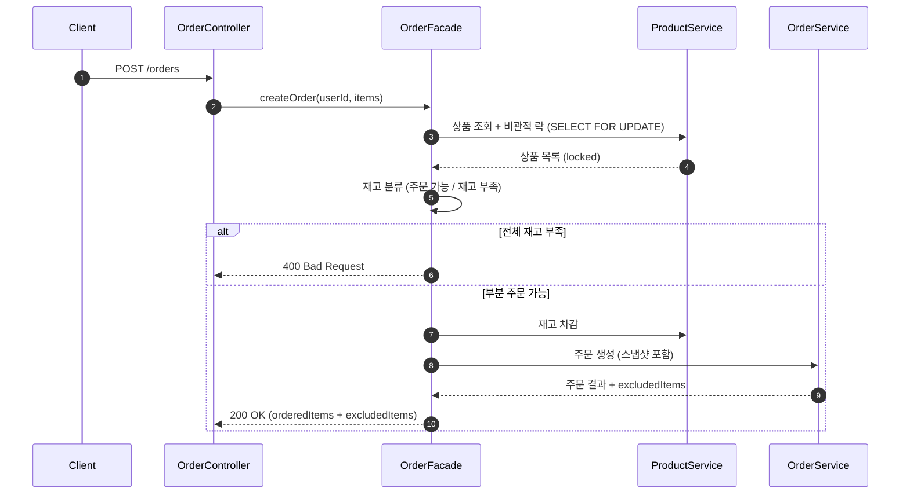
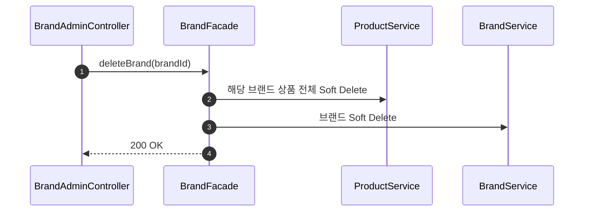

## 📌 Summary

- **배경**: 2주차 Quest - 이커머스 핵심 도메인(브랜드, 상품, 좋아요, 주문)에 대한 설계 문서 작성
- **목표**: 모호한 요구사항에서 숨겨진 정책 결정을 발견하고, 개발 가능한 수준의 설계 문서 4종 완성
- **결과**: 요구사항 명세서(24개 API + 정책 결정 14건), 시퀀스 다이어그램 5개, 레이어 아키텍처 + 클래스 다이어그램 5개, ERD 6개 테이블 + 인덱스 7개 설계 완료


## 🧭 Context & Decision

### 문제 정의

- **배경**: "이커머스 만들어줘"라는 요구사항이 주어졌지만, API 명세만으로는 결정할 수 없는 수많은 정책 결정이 숨어 있었음
- **핵심 문제**: 기획자가 모든 요구사항을 알고 있지 않음. 히든 케이스를 다 알고 있지도 않음. 결국 개발자가 전달받은 시나리오와 요구사항을 분석하면서 세부적인 요구사항을 뽑아내야 함
- **세부 사항 결정**: 세부 사항 결정 시, 기술적인 결정도 중요하지만 비즈니스적인 이해관계를 이해하고 유관부서의 정책또한 고려해 결정해야함
- **성공 기준**: 모든 요구사항을 포함하고 세부적인 정책이 결정된 4개 설계 문서(requirements, sequence, class, erd) 완성 + 문서 간 일관성 유지

---

### 선택지와 결정

#### 1. 모호한 요구사항에서 숨겨진 정책 결정 찾기

**고민**: API 명세에는 "좋아요 등록", "쿠폰 사용", "주문 생성"이라고만 적혀 있는데, 이것만으로 개발이 가능한가?

**발견한 숨겨진 결정사항들**:

| 질문                     | 결정              | 이유                                                                                                                                           |
|------------------------|-----------------|----------------------------------------------------------------------------------------------------------------------------------------------|
| 좋아요 삭제 방식?             | Soft Delete     | 좋아요 데이터는 단순 기능이 아니라 마케팅/MD 부서의 핵심 지표. "이 상품 좋아요 몇 번 눌렸다 취소됐다"는 통계 요청이 반드시 오기 때문에 Hard Delete하면 복원 불가                                         |
| 브랜드/상품 삭제 방식?          | Soft Delete     | 삭제된 브랜드의 상품으로 이미 주문이 존재할 수 있음. Hard Delete하면 주문 이력에서 "어떤 브랜드의 어떤 상품"인지 추적이 불가능해지므로 과거 데이터 정합성을 위해 논리 삭제                                      |
| 주문 시 재고 부족?            | 부분 주문 허용        | 5개 담았는데 1개 품절이라고 주문 자체를 막으면 나머지 4개 매출도 날아감. 매출 관점에서 가능한 것만이라도 주문시키는 게 합리적이고 매출부서에서는 분명 이렇게 요청함                                               |
| 좋아요 중복 요청?             | 멱등성 보장 (200 OK) | 좋아요는 네트워크 지연으로 중복 요청이 빈번한 기능. 이미 눌린 상태에서 다시 눌렀다고 409 에러를 던지면 UX만 나빠지고, 서버 입장에서도 결과가 동일하므로 에러 처리할 이유가 없음                                      |
| 좋아요 취소 시 없으면?          | 멱등성 보장 (200 OK) | 위와 동일한 맥락. API 를 분리했기 때문에 이미 취소된 좋아요를 다시 취소 요청해도 최종 상태는 "취소됨"으로 동일. 클라이언트가 현재 상태를 정확히 알 필요 없이 의도한 결과만 보장하면 됨                                 |
| 장바구니 주문 시 일부 품절 상품 알림? | 응답에 품절 상품 목록 포함 | 부분 주문을 허용하되, 유저가 "내가 뭘 못 샀는지" 모르면 CS가 폭주함. 주문 응답에 품절 상품을 포함해서 클라이언트에 품절 안내 UI를 바로 보여줄 수 있도록 해야함                                              |
| 삭제된 상품 좋아요?            | 허용              | Soft Delete된 상품은 목록에서 이미 노출되지 않으므로 유저가 좋아요를 누를 경로 자체가 없음. 굳이 검증 로직을 추가해 복잡도를 높일 필요 없이 자연스럽게 방어됨, 만약 노출되었다해도 삭제된 상품의 좋아요는 장애상황은 아님. 정책에 따르면 됨 |

**결론**: 요구사항 명세는 "어떻게 만들까"를 정리하면서 나오는 나만의 고민들을 통해 "어떤 결정을 내려야 하는가"를 찾는 과정이었음

---

#### 2. 요구사항 명세는 누구를 위한 문서인가?

**고민**: Claude Skill을 사용해서 작성한 요구사항 명세는 기능과 역할은 완벽했지만, 너무 디테일하고 이해하기 쉬운 구조는 아니었음. 예를 들어 난 잘 정리된 읽기 좋은 책이 필요한데, 교수님이 들고온 두껍고 복잡한 원서 같은 느낌이었음

**핵심 질문**: 이 문서를 원하는 주체는 Claude인가? 아니면 프롬프트를 던지고 정리해야 하는 나인가?

**결론**: 결국 명세를 읽는 주체가 이제는 양쪽 모두 이기 때문에 중간지점을 찾아야 함
- 문서를 분리하는 방법도 있겠지만 앞부분과 뒷부분을 적절하게 나누는 방법으로 선택했음
- 앞부분: 개발자를 위한 **명세 요약 + 간략한 표 템플릿**으로 가독성 확보
- 뒷부분: Claude가 참조할 수 있도록 **디테일한 명세**를 빠짐없이 작성

---

#### 3. 시퀀스 다이어그램, 24개 API 전부 작성해야 할까?

**고민**: 다 작성하면 Claude는 더 편하게 작업하지 않을까?

**결론**: 아니다. 이미 텍스트 기반으로 요구 사항 명세가 잘 작성되었기 때문에 Claude를 위해 도식화할 필요는 없다고 생각했음.
모든 API의 시퀀스 다이어그램을 작성하면 문서를 작성하는 사람도, 읽는 사람도 피로도가 올라갈것 이라고 판단.
따라서 **기준을 세우고 팀동료에게 설명한다는 생각으로 핵심 로직만** 작성

**시퀀스 다이그램 작성할 비즈니스 로직을 선정한 기준**:
- 여러 도메인이 협력하는 복잡한 흐름
- 트랜잭션 경계가 명확해야 하는 흐름
- 동시성/정합성 처리가 필요한 흐름

**선정된 5개의 API**:

| # | API | 선정 이유 |
|---|-----|----------|
| 1 | 주문 생성 (C10) | 부분 주문 분기 + 비관적 락 + 스냅샷 저장 |
| 2 | 좋아요 등록 (C07) | 멱등성 분기 + Soft Delete 복원 |
| 3 | 좋아요 취소 (C08) | 멱등성 (없으면 no-op) + Soft Delete |
| 4 | 브랜드 삭제 (A05) | 연쇄 Soft Delete 트랜잭션 경계 |
| 5 | 상품 등록 (A08) | 브랜드 존재 검증 + Soft Delete 브랜드 처리 |

---

#### 4. 클래스 다이어그램, 뭘 중점으로 봐야 할까?

**고민**: 평소에도 실무처럼 규모가 큰 프로젝트에서는 클래스 다이어그램은 너무 복잡해서 가독성이 떨어지고 이해하기도 힘들었음

**결론**: 클래스의 세부항목을 정의하는 것보다 **클래스 간의 관계도**가 중요. 좋은 구조를 짜는 게 바로 좋은 레이어 아키텍처를 설계하는 것.

**핵심 포인트**:
- Facade 패턴으로 도메인 간 역할과 책임 분리
- Service 간 순환 참조 방지 (BrandService ↔ ProductService → BeanCurrentlyInCreationException)
- 해결: Facade 레벨에서 조합 (BrandFacade → BrandService + ProductService)

**문서 구성**:
```
03-class-diagram.md
├── 1. 레이어 아키텍처 전체 구조 (flowchart) → 의존 방향, Facade 역할
└── 2. 도메인 클래스 다이어그램 (classDiagram × 5개) → Entity 필드, 메서드, 관계
```

**클래스 다이어그램의 세부사항은 개발하면서 추가될 수 있다고 생각함**. 경험상 지금 모든 요구사항을 파악했다고 생각하면 그것도 큰 오산이니까.
아키텍처를 이해하고 클래스다이어그램을 바라보면 클래스간의 관계가 보이지 않을까?

---

#### 5. ERD 작성시 테이블간 FK 제약을 걸어야하는가?

**고민**: Claude는 DB에 FK 제약을 걸어뒀는데, 실무에서는 보통 사용 안 함(내가 잘 못하고 있었나?)

**FK 안 쓰는 이유**:

| 이유             | 설명                                       |
|----------------|------------------------------------------|
| 운영 이슈          | 마이그레이션 순서, 벌크 INSERT 느림, 긴급 데이터 수정 불가    |
| 성능             | 매 INSERT마다 참조 테이블 조회 발생                  |
| Soft Delete 충돌 | `deleted_at` 설정해도 FK는 통과 → 비즈니스 규칙 보장 못함 |
| 서비스 검증 중복      | FK 있어도 어차피 서비스에서 검증함 → 이중 검증             |
| MSA 전환         | 서비스 분리 시 FK 자체가 불가능                      |

**결론**: FK 제거 + 서비스에서 검증 + 인덱스만 생성

```kotlin
// FK 없이 서비스 애플리케이션 레벨에서 검증
fun createProduct(brandId: Long, ...) {
    val brand = brandService.getById(brandId)
        ?: throw CoreException(ErrorType.NOT_FOUND)
}
```

---

#### 6. 설계 문서 작성의 범위

**고민**: 실무에서 모든 문서를 꼭 작성하고 개발해야할까? 작성한다면 어떤 순서로 설계 문서를 작성할까?

**결론**: 요구사항 정의는 필수이나, 프로젝트 규모에 따라 달라진다고 생각함.
오히려 작은 프로젝트에 모든 문서의 작성은 허들이 될수 있음.
 만약 다 작성하는 프로젝트라면 순서는 추상화 수준이 높은 것 → 낮은 것 순서로 작성

```
요구사항 정의 → 시퀀스 → 클래스 → ERD
(What)                    (How)
```

| 순서 | 문서 | 질문 |
|------|------|------|
| 1 | 요구사항 | 무엇을? |
| 2 | 시퀀스 | 어떤 순서로? |
| 3 | 클래스 | 어떤 구조로? |
| 4 | ERD | 어떻게 저장? |


## 🏗️ Design Overview

### 변경 범위

- **신규 추가**: 설계 문서 4종

### 산출물

| 파일 | 내용 | 핵심 포인트 |
|------|------|------------|
| `docs/design/01-requirements.md` | 요구사항 + 정책 결정 | 비즈니스 규칙 14건 + 숨겨진 결정사항 발견 |
| `docs/design/02-sequence-diagrams.md` | 시퀀스 다이어그램 5개 | 주문/좋아요/브랜드 삭제/상품 등록 핵심 흐름 |
| `docs/design/03-class-diagram.md` | 레이어 아키텍처 + 클래스 다이어그램 | Facade 패턴, 의존 방향, 6개 Entity |
| `docs/design/04-erd.md` | ERD + 인덱스 설계 | 6개 테이블, 7개 인덱스, FK 없음 |

### 주요 설계 결정 요약

| 서비스 기능 | 결정                                              |
|--------|-------------------------------------------------|
| 삭제 정책  | Like/Brand/Product → Soft Delete, Order → 삭제 불가 |
| 동시성    | 주문 재고 차감 → 비관적 락 (`SELECT FOR UPDATE`)          |
| 멱등성    | 좋아요 등록/취소 → 중복 시에도 200 OK                       |
| 브랜드 삭제 | 연쇄 Soft Delete (브랜드 → 하위 상품 전체)                 |
| 주문 스냅샷 | 상품명, 단가, 브랜드명을 주문 시점에 복사                        |
| FK 제약  | 없음 (서비스에서 검증 + 인덱스만 생성)                         |

### 레이어 아키텍처

```
Controller → Facade → Service → Repository

[금지] Service → Service (순환 참조 방지)
[허용] Facade → 여러 Service (도메인 간 협력은 Facade에서)
```

### Facade 의존 관계

```
UserFacade     → UserService
BrandFacade    → BrandService + ProductService (연쇄 삭제)
ProductFacade  → ProductService + BrandService (브랜드 존재 검증)
LikeFacade     → LikeService + ProductService (상품 존재 확인)
OrderFacade    → OrderService + ProductService (재고 락 + 차감)
```


## 🔁 Flow Diagram

### 주문 생성 (가장 복잡한 흐름)



### 브랜드 삭제 (연쇄 Soft Delete)




## 💬 리뷰 포인트

1. 재고 차감을 비관적락으로 설계했는데, 보통 대규모 트래픽을 처리하는 실무에서는 병목이 생길것 같은데 어떤식으로 처리하나요?

2. claude 가 erd 에 FK를 세팅해 두었서, FK 제거하고 서비스 애플리케이션 레벨에서 검증하도록 했습니다. DB 레벨 정합성 없이 데이터가 꼬일 수 있는 상황은 없을까요?(저도 실무에서 FK를 사용안하고 있기도 한데 한번도 고민해본적이 없던것 같아 부끄러웠습니다)

3. 좋아요/브랜드/상품은 soft delete, 주문은 삭제 불가로 도메인마다 다르게 가져갔는데, 보통 실무에서는 삭제 정책을 기능에 따라 soft 또는 hard 로 분리하나요? 저희 회사는 보통 모든 통계 요청 때문에 soft delete 로 진행되는데 그럴경우 어떤 이슈가 있을지 궁금합니다.

4. 쿠폰 API는 이번 범위에 없지만 주문 흐름에서 참조하니까 테이블 구조와 검증 로직은 미리 설계에 반영했습니다. 아직 구현하지 않을 기능인데 설계에 미리 넣는게 맞는 방향일까요?
