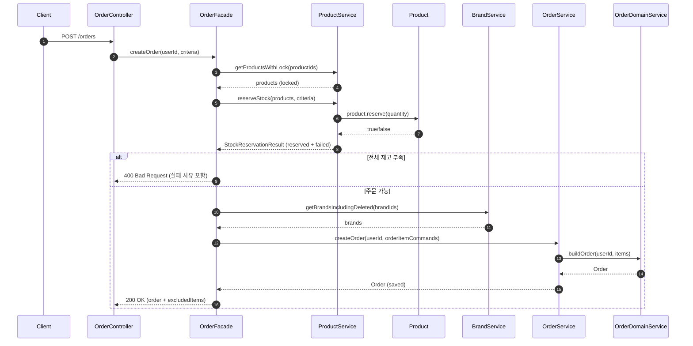
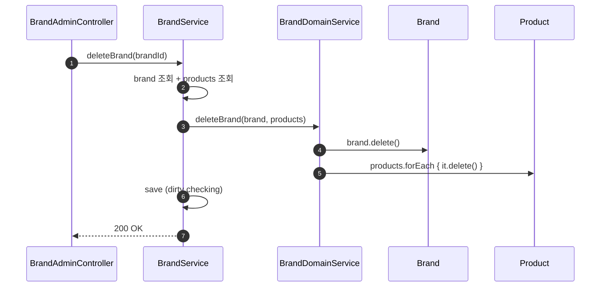
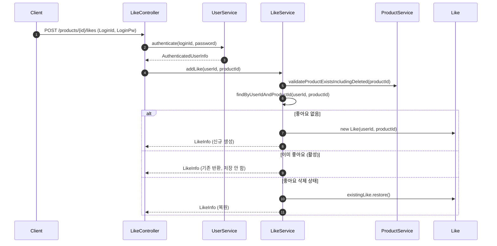
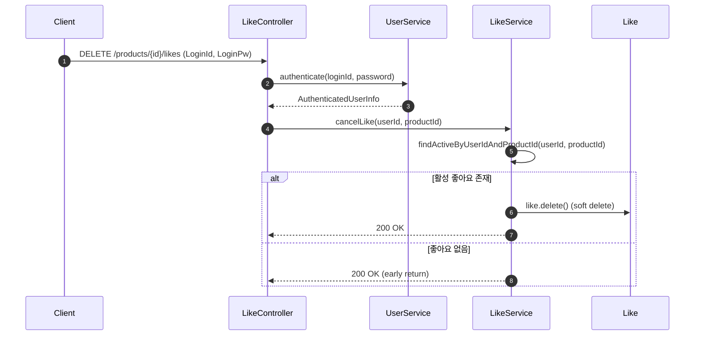
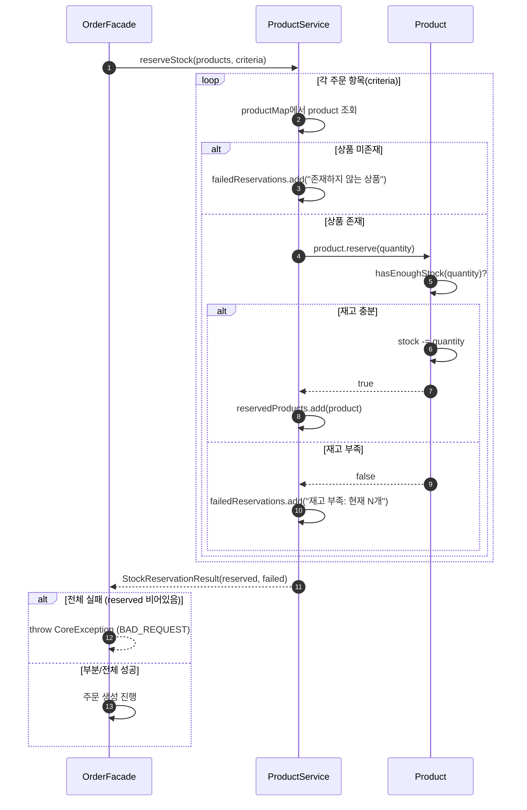
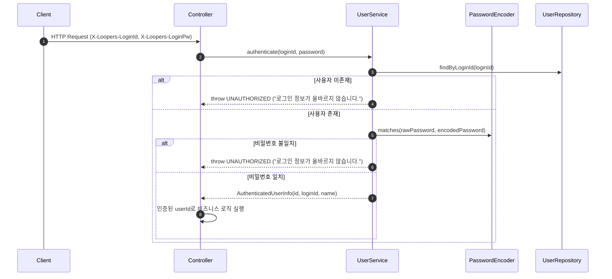

## 📌 Summary

- **배경**: 3주차 Quest - 2주차에 작성한 설계 문서를 기반으로 이커머스 핵심 도메인(브랜드, 상품, 좋아요, 주문) 구현
- **목표**: 레이어드 아키텍처 + DIP 기반으로 4개 도메인을 TDD로 구현하고, 리팩토링을 통해 도메인 모델의 책임 경계를 명확히 하기
- **결과**: 4개 도메인 구현 완료 (24개 API), 도메인별 3종 테스트(단위/통합/E2E) 작성


## 🧭 Context & Decision

### 문제 정의

- **배경**: 설계 문서(요구사항, 시퀀스, 클래스, ERD)는 완성되어 있었지만, 실제 구현 과정에서 설계가 커버하지 못한 세부 결정사항이 계속 나타남
- **핵심 문제**: "설계대로 만들면 되는 거 아닌가?"라고 생각했지만, 구현하면서 `@Transactional` 위치, Facade 소유권, Aggregate 경계 같은 아키텍처 결정을 코드 레벨에서 해야 했음
- **성공 기준**: 4개 도메인이 설계 문서와 정합하면서도, 각 레이어의 책임이 명확하고 테스트로 검증된 상태

---

### 선택지와 결정

#### 1. `@Transactional`은 어디에 있어야 하는가?
**고민**: Brand 구현 초기에 Domain Service에 `@Transactional`을 직접 붙여놓은 상태였음. DIP 관점에서 이게 맞는지?

**결정**: Application 레이어(Facade)가 트랜잭션 경계를 담당

**결정 이유**:
- `@Transactional`은 Spring 프레임워크의 인프라 관심사 → Domain Service에 붙이면 DIP 위반(같은 이유로 빈주입도 config 처리)
- DomainService 는 순수 도메인 관련 객체의 역할과 책임을 가져야한다고 판단.

---

#### 2. Facade는 도메인마다 만들어야 하는가?
**고민**: 모든 도메인의 Application Service의 이름이`000Facade`일까, `000Service`일까?

**결정**: 기본은 000Service → 여러 도메인을 조합하는 유스케이스에서만 000Facade

**결정 이유**:

- 단일 도메인 유스케이스라면 `Service`가 더 명확하다고 판단, 하나의 Aggregate만 다루는 경우는 사실 `Facade`가 아니라 Application Service 역할임.
- `Facade`는 `조합자(orchestrator)`의 의미가 강해서 여러 도메인을 엮어서 하나의 트랜잭션 시나리오를 만들 때만 적절하다고 생각
- 전부 `Facade` 로 만들면 결국 `Facade`의 의미가 사라진다고 판단. => 이름이 아키텍처 의도

---

#### 3. Application Service가 000Repository를 주입받는 건 DDD 위반인가?

**고민**: ApplicationService와 DomainService중 Repository를 어디에 위치해야하지?

**결정**:
-  ApplicationService에 000Repository를 주입
-  비즈니스 규칙은 DomainService 또는 Aggregate 내부에 둔다
-  Facade는 Repository를 직접 사용하지 않는다

**결정 이유**:
- ApplicationService가 여러 Repository를 사용하는 것은 유스케이스 실행을 위한 조회·저장 조율이라고 판단, 이는 인프라를 다루는 책임이지 도메인 침범이 아님
- DomainService는 순수한 비즈니스 로직으로 유지해야 한다고 판단 => 도메인 규칙을 영속성 기술과 분리
- Facade는 ApplicationService를 조합하는 오케스트레이션 역할에 집중해야 하며, 조회·저장 책임까지 가지면 계층 경계가 흐려짐

---

#### 4. 재고 정책은 누구의 책임인가? (Aggregate 경계)

**고민**: 초기 구현에서 `OrderDomainService`가 재고 검증 + 분류 + Order 조립을 모두 담당. 재고는 Product의 관심사인데 Order가 관리하는 구조

**결정**: Product Aggregate로 이동

**결정 이유**:
- 재고는 Product의 상태(state)에 해당하므로, 해당 상태를 변경·보호하는 책임은 Product Aggregate 내부에 있어야 한다고 판단
- Order가 재고를 직접 관리하면 Aggregate 경계가 흐려지고, 불필요한 강한 결합이 발생한다고 생각
- 재고 차감·예약은 불변조건(invariant)을 지켜야 하는 핵심 로직이므로, 외부(OrderDomainService)가 아닌 Product가 스스로 검증하도록 하는 것이 일관성 측면에서 적절하다고 판단
- Aggregate는 자신의 정합성을 스스로 보장해야 하므로, 재고 정책을 Product 내부로 이동시키는 것이 DDD 원칙에 부합한다고 생각

---

#### 5. DTO 분리 전략 — Criteria vs Command vs Info

**고민**: Controller → Service → Domain Service 사이에 데이터를 어떻게 전달할 것인가?

**결정**: Criteria, Command, Info를 역할 기준으로 분리

**결정 이유**:
- Criteria는 외부 요청의 최소 입력값만 담는 용도로 한정하여, 애플리케이션 계층에서 조회와 가공의 출발점 역할을 하도록 분리했다고 판단
- Command는 도메인 로직 실행에 필요한 풍부한 데이터를 담아, 도메인이 외부 조회 로직에 의존하지 않도록 하기 위함이라고 생각
- Info는 조회 결과 반환 전용 DTO로 두어, 도메인 엔티티를 직접 노출하지 않고 표현 계층과 분리하기 위함이라고 판단
- API DTO와 Application DTO를 명확히 구분함으로써, Controller 변경이 Service에 전파되지 않도록 레이어 간 의존성을 차단
---

## 🏗️ Design Overview

### 변경 범위

- **영향 받는 모듈/도메인**: commerce-api 전체 (Brand, Product, Like, Order, User)
- **신규 추가**: 4개 도메인 구현 (Entity, Repository, Service, Controller, ApiSpec, DTO) + 테스트 + .http 파일
- **제거/대체**: Member → User 리네이밍, ProductFacade 제거, OrderResult → OrderResultInfo 변경, OrderProductSnapshot 제거

### 레이어 아키텍처 (최종)

```
Interfaces → Application → Domain ← Infrastructure
```

```
Controller → Facade (@Transactional, 2+ 서비스 조합 시만)
           → Service (단일 도메인 로직)
           → Domain Service (순수 비즈니스 규칙, 프레임워크 비의존)
           → Repository Interface (도메인 레이어)
                    ↑ 구현
           RepositoryImpl (인프라 레이어)
```

### 주요 컴포넌트 책임

| 컴포넌트 | 책임 |
|----------|------|
| `OrderFacade` | 주문 생성 유스케이스 조율 (재고 예약 → 브랜드 조회 → 주문 생성) |
| `OrderDomainService` | 확정된 아이템으로 Order 객체 조립 (순수 빌더) |
| `ProductService.reserveStock()` | 재고 예약 시도 + 성공/실패 분류 |
| `Product.reserve()` | 재고 검증 + 차감 (Aggregate 자율성) |
| `BrandDomainService` | 브랜드 삭제 시 하위 상품 cascade soft delete |
| `BrandService` | 브랜드 CRUD + 데이터 조회/저장 조율 |
| `LikeService` | 좋아요 등록/취소 (멱등성 보장) |

### 테스트 구조

| 도메인 | 단위 (Domain) | 단위 (Service) | 통합 | E2E |
|--------|:---:|:---:|:---:|:---:|
| Brand | BrandTest, BrandDomainServiceTest | BrandServiceTest | BrandServiceIntegrationTest | BrandV1ApiE2ETest |
| Product | ProductTest | ProductServiceTest | ProductServiceIntegrationTest | ProductV1ApiE2ETest |
| Like | LikeTest | LikeServiceTest | LikeServiceIntegrationTest | LikeV1ApiE2ETest |
| Order | OrderTest, OrderDomainServiceTest | OrderServiceTest, OrderFacadeTest | OrderServiceIntegrationTest, OrderFacadeIntegrationTest | OrderV1ApiE2ETest, OrderAdminV1ApiE2ETest |
| User | UserTest | UserServiceTest | UserServiceIntegrationTest | UserV1ApiE2ETest |


## 🔁 Flow Diagram

### 주문 생성 (최종 흐름)



### 브랜드 삭제 (연쇄 Soft Delete)



### 좋아요 등록/취소 (멱등성 보장)





### 재고 예약 상세 흐름



### 사용자 인증 흐름


