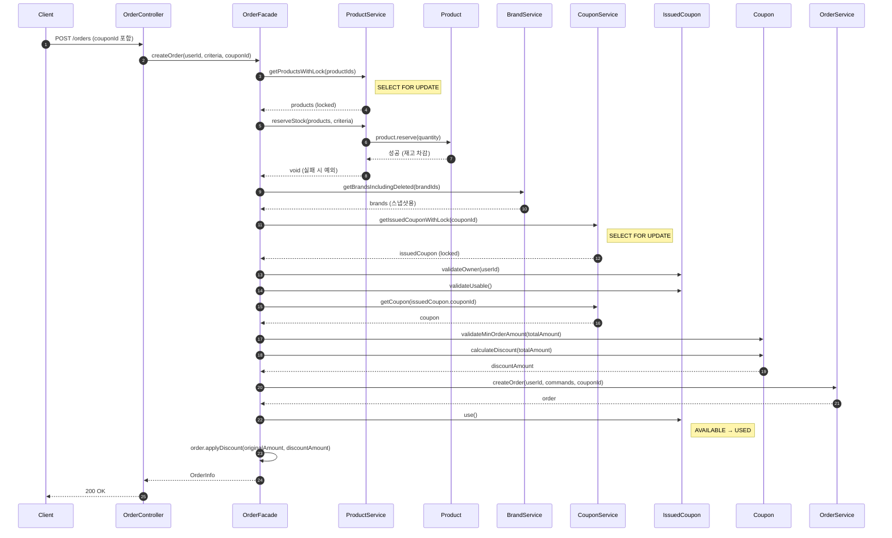
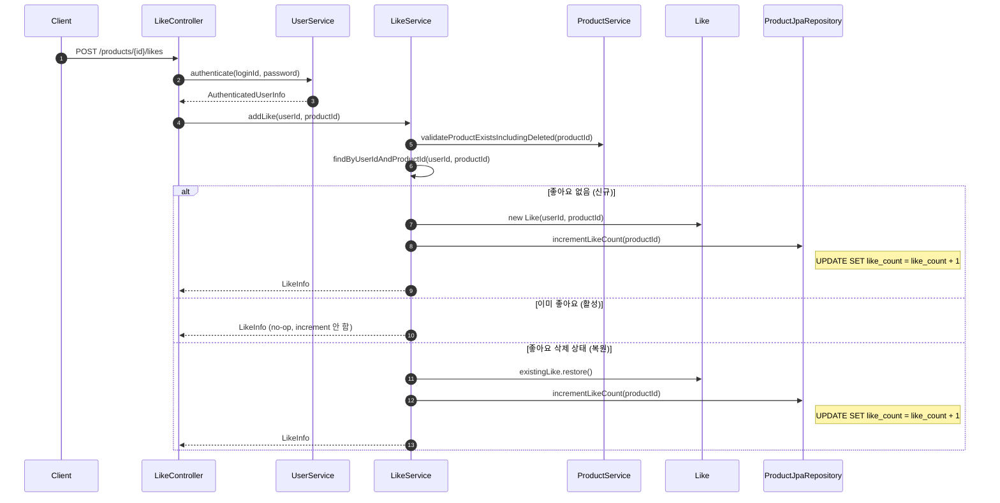

## 📌 Summary

- **배경**: 4주차 Quest - 쿠폰 도메인 구현 + 주문에 쿠폰 적용 + 동시성 제어. 3주차까지 구현한 Brand, Product, Like, Order 위에 쿠폰을 얹고, 트랜잭션 원자성과 동시성 정합성을 보장해야 했음
- **목표**: 도메인별 특성에 맞는 동시성 전략 분리 (Atomic Update / 비관적 락 / 유니크 제약), 주문-쿠폰 통합 시 트랜잭션 원자성 보장
- **결과**: 쿠폰 도메인 구현 완료 (14개 API), 주문에 쿠폰 적용, 좋아요 Atomic Update 도입, 동시성 테스트 3종 (재고/쿠폰/좋아요)

## 🧭 Context & Decision

### 문제 정의

- **배경**: 3주차까지 비관적 락 하나로 재고 동시성을 해결했지만, "Atomic Update → 낙관적 락 → 비관적 락"을 고민함. 쿠폰 도메인 추가와 함께 각 도메인의 동시성 전략을 근거 있게 재설계해야 했음
- **핵심 문제**: 모든 곳에 비관적 락을 쓰는 것은 "무거운 도구를 먼저 꺼낸" 것. 도메인마다 충돌 빈도, 연산 복잡도, 비즈니스 요구사항이 다른데 같은 전략을 적용하는 게 맞는지 재점검이 필요했음
- **성공 기준**: 도메인별로 왜 그 전략을 선택했는지 설명할 수 있고, 동시성 테스트로 정합성이 증명된 상태

---

### 선택지와 결정

#### 1. 동시성 전략 — 도메인 특성에 따른 분리

**고민**: 락 고민 우선순위(Atomic Update → 낙관적 락 → 비관적 락)를 내 코드에 적용하면 어떻게 되는가?

**결정**: 도메인별로 다른 전략 적용

| 도메인 | 전략 | 이유 |
|--------|------|------|
| 재고 차감 | 비관적 락 | Rich Domain Model(`product.reserve()`)이 R-M-W를 강제. 충돌 빈도 높음 |
| 쿠폰 사용 | 비관적 락 | 낙관적 락을 고려했으나, 주문 트랜잭션 내부에서 충돌 시 전체 롤백 + 재시도 무의미 |
| 좋아요 카운트 | Atomic Update | 단순 +1/-1 연산, 조건 분기 불필요. `UPDATE products SET like_count = like_count + 1`로 DB에 위임 |
| 좋아요 중복 방지 | DB 유니크 제약 | 단순 INSERT, 중복만 막으면 되므로 `uk_likes_user_product` 제약조건으로 충분 |

**쿠폰에 낙관적 락을 고려했지만 사용하지 않은 이유**:
- 발급된 쿠폰은 한 유저 소유이므로 동시 요청은 같은 유저의 다중 기기뿐 → 충돌 빈도가 낮아서 낙관적 락이 적합해 보였음
- 멘토링에서도 "1건만 성공하고 나머지는 실패시키면 충분"한 경우 낙관적 락이 적합하다고 정리됨
- **그러나 쿠폰은 주문 트랜잭션 안에서 사용됨**: `OrderFacade`에서 재고 차감 → 쿠폰 사용이 하나의 `@Transactional`로 묶여 있어서, 낙관적 락 충돌(`OptimisticLockException`)이 발생하면 이미 차감된 재고까지 전체 롤백됨
- **재시도가 의미 없음**: 멘토님이 강조한 핵심 — "재시도하는 것이 낙관적 락이 아님. 실패해도 괜찮을 때 써야 함". 다른 트랜잭션이 이미 USED로 변경한 상태에서 재시도해도 결과는 똑같이 실패
- 쿠폰 단독이라면 낙관적 락이 맞지만, 주문 플로우 안에서는 충돌 = 전체 주문 실패가 되므로 비관적 락으로 줄 세워서 확실하게 처리하는 게 합리적

**결정 이유 (전체)**:
- Atomic Update가 1순위인 이유는 "부하가 가장 적어서"이지 "항상 써야 해서"가 아님
- 재고/쿠폰은 "조회 → 판단 → 수정" 패턴이라 엔티티를 메모리에 올려야 함. `product.reserve()`, `issuedCoupon.validateUsable()` 같은 Rich Domain Model 메서드를 먼저 설계한 시점에서 이미 R-M-W 패턴이 확정됨
- 좋아요 카운트는 현재 값을 읽을 필요 없는 단순 산술 연산 → Atomic Update의 교과서적 케이스
- 좋아요 중복은 애플리케이션 레벨 락 없이 DB 제약조건이 가장 가벼운 방식

**깨달음**: 동시성 전략은 독립적인 선택이 아니라 도메인 모델 설계의 결과물. 우선순위를 제대로 적용하려면 도메인 모델 설계 단계에서부터 "이 로직이 엔티티 안에 있어야 하는가, 쿼리 한 방으로 해결 가능한가?"를 함께 고민했어야 함

---

#### 2. 주문 정책 — 부분 주문 허용 → 전체 성공 or 전체 실패

**고민**: 기존 주문 로직은 "부분 주문"을 허용. 상품 A, B를 주문했는데 B 재고가 부족하면 A만 주문하고 B는 제외 목록으로 반환. 쿠폰 적용 시에는 부분 주문 불가, 미적용 시에는 허용 — 두 갈래 분기가 존재

**결정**: 전체 성공 or 전체 실패로 통일

**결정 이유**:
- 사용자가 A, B를 함께 주문한 건 "둘 다 원해서"인데, 동의 없이 일부만 결제하는 건 UX에 맞지 않음
- 일반적인 이커머스에서도 동의 없이 일부만 결제하지 않음
- 부분 주문이 R-M-W 패턴을 강제했던 구조적 원인이었음. "상품별로 성공/실패를 판단하고 분기"하는 로직이 Read를 먼저 해야 하는 이유였고, 이 요구사항이 사라지면서 코드 복잡도가 크게 줄어듦
- `excludedItems`, `FailedReservation` 같은 중간 구조체가 전부 사라지고, 쿠폰/비쿠폰 분기가 단일 플로우로 통합

**트레이드오프**: 매출 관점에서 "가능한 것만이라도 주문"이 유리할 수 있지만, 사용자 의도 존중과 코드 단순성을 우선함

---

#### 3. 쿠폰 만료 처리 — 스케줄러 vs 사용 시점 시간 비교

**고민**: 쿠폰 만료를 스케줄러로 주기적으로 EXPIRED 상태로 변경할지, 사용 시점에 `expiredAt.isBefore(now())`로 판단할지

**결정**: 사용 시점 시간 비교 방식

**결정 이유**:
- 스케줄러는 주기 사이 불일치 문제(만료됐는데 아직 AVAILABLE), 장애 시 만료 처리 누락, 불필요한 DB UPDATE 부하
- 시간 비교는 항상 정확하고 추가 인프라 없이 동작
- "상태를 저장하지 않고 계산으로 판단한다"는 원칙이 불필요한 복잡성을 줄여줌
- `IssuedCouponStatus.EXPIRED` enum은 존재하지만 실제로 이 상태로 변경하는 코드는 없음. 상태 전이는 `AVAILABLE → USED`만 존재

---

#### 4. Atomic Update의 JPA 캐시 불일치 대응

**고민**: `@Modifying` 쿼리는 JPA 1차 캐시를 우회해서 DB를 직접 UPDATE. DB의 like_count가 1이 되었지만 영속성 컨텍스트에는 0으로 남는 stale read 문제

**결정**: `clearAutomatically = true` + `GREATEST(like_count - 1, 0)` 음수 방지

**결정 이유**:
- `clearAutomatically = true`로 UPDATE 실행 후 영속성 컨텍스트를 자동 클리어하여 DB와 불일치 방지
- `GREATEST`로 데이터 마이그레이션 오류나 수동 DB 조작으로 인한 음수 방지
- Product 엔티티의 likeCount는 `private set`으로 읽기 전용만 두고, 쓰기는 `@Modifying @Query`로만 수행하여 Rich Domain Model과 Atomic Update를 공존시킴

**트레이드오프**: 클리어 시 같은 영속성 컨텍스트의 다른 엔티티도 detach되지만, LikeService에서 이미 저장한 Like 엔티티는 인메모리 참조의 값을 복사한 후이고 lazy 연관이 없으므로 안전

## 🏗️ Design Overview

### 변경 범위

- **영향 받는 모듈/도메인**: commerce-api (Coupon 신규, Order 변경, Product 변경, Like 변경)
- **신규 추가**: 쿠폰 도메인 전 레이어 (Entity, Repository, Service, Controller, ApiSpec, DTO) + 동시성 테스트 3종 + .http 파일
- **변경**: Order 엔티티에 couponId/originalAmount/discountAmount 추가, OrderFacade에 쿠폰 적용 흐름 추가, Product 엔티티에 likeCount 추가, LikeService에 Atomic Update 연동
- **제거**: 부분 주문 관련 코드 (excludedItems, FailedReservation, StockReservationResult)

### 주요 컴포넌트 책임

| 컴포넌트 | 책임 |
|----------|------|
| `OrderFacade` | 주문 생성 유스케이스 조율 (비관적 락 → 재고 검증 → 쿠폰 검증/적용 → 주문 생성) |
| `CouponService` | 쿠폰 템플릿 CRUD + 쿠폰 발급 + 비관적 락으로 발급 쿠폰 조회 |
| `Coupon` | 할인 계산 (FIXED/RATE), 만료 판단, 최소 주문 금액 검증 |
| `IssuedCoupon` | 소유자 검증, 사용 가능 여부 판단, AVAILABLE → USED 상태 전이 |
| `ProductJpaRepository` | 좋아요 Atomic Update (`incrementLikeCount`, `decrementLikeCount`) |
| `LikeService` | 좋아요 등록/취소 + 상태 변경 시에만 Atomic Update 호출 (멱등성 보장) |
| `ProductService` | 재고 검증 + 차감 (비관적 락 기반) |

### 테스트 구조

| 도메인 | 단위 (Domain) | 단위 (Service) | 통합 | E2E | 동시성 |
|--------|:---:|:---:|:---:|:---:|:---:|
| Coupon | CouponTest, IssuedCouponTest | CouponServiceTest | CouponServiceIntegrationTest | CouponV1ApiE2ETest, CouponAdminV1ApiE2ETest | CouponConcurrencyTest |
| Order | OrderTest | OrderFacadeTest | OrderFacadeIntegrationTest | OrderV1ApiE2ETest | StockConcurrencyTest |
| Like | - | - | - | - | LikeConcurrencyTest |
| Product | - | - | - | - | (StockConcurrencyTest에서 함께 검증) |

### 동시성 보장 메커니즘 비교

| 도메인 | 전략 | 메커니즘 | 검증 방법 |
|--------|------|----------|-----------|
| 재고 (Product) | 비관적 락 | `SELECT FOR UPDATE` → `product.reserve()` | 10스레드 동시 주문, 재고 5개 → 5건만 성공, 재고 0 |
| 발급 쿠폰 (IssuedCoupon) | 비관적 락 | `SELECT FOR UPDATE` → `validateUsable()` → `use()` | 10스레드 동시 사용, 1건만 성공, 쿠폰 USED |
| 좋아요 카운트 (Product) | Atomic Update | `UPDATE SET like_count = like_count + 1` | 10스레드 동시 좋아요, likeCount == 10 |
| 좋아요 중복 (Like) | DB 유니크 제약 | `uk_likes_user_product` | 10스레드 동시 좋아요 (동일 유저), 레코드 1개 |

### 동시성 테스트 구조

3개 테스트 모두 `@SpringBootTest` + `CountDownLatch` + `ExecutorService` 패턴으로 작성했다.
`CountDownLatch(1)`로 10개 스레드를 대기시킨 뒤 `countDown()`으로 동시에 출발시켜 실제 동시 요청 상황을 재현하고, DB 최종 상태로 정합성을 검증한다.

- **StockConcurrencyTest**: 재고 5개 상품에 10스레드가 `orderFacade.createOrder()` 동시 호출 → Product에 비관적 락이 걸려 순차 처리됨 → 5건 성공 / 5건 실패 / 재고 0
- **CouponConcurrencyTest**: 동일 발급 쿠폰(IssuedCoupon)으로 10스레드가 `orderFacade.createOrder(couponId)` 동시 호출 → IssuedCoupon에 비관적 락이 걸려 순차 처리됨 → 1건 성공 / 9건 실패 / 쿠폰 USED / 주문 1건. 락 대상은 Coupon(템플릿)이 아니라 IssuedCoupon(발급 쿠폰)이며, IssuedCoupon의 status가 `AVAILABLE → USED`로 변하는 R-M-W 패턴이므로 락이 필요
- **LikeConcurrencyTest (중복 방지)**: 동일 유저가 같은 상품에 10스레드로 `likeService.addLike()` 동시 호출 → DB 유니크 제약(`uk_likes_user_product`)이 중복 INSERT 차단 → 레코드 1개만 존재
- **LikeConcurrencyTest (카운트 정합성)**: 서로 다른 유저 10명이 같은 상품에 동시 좋아요 → Atomic Update(`like_count = like_count + 1`)가 DB 레벨에서 원자적 처리 → likes 10개 / likeCount == 10
- **ConnectionPoolExhaustionTest**: 비관적 락의 구조적 한계 증명. 커넥션 풀 5개(`@TestPropertySource`로 오버라이드), connection-timeout 250ms 환경에서 100개 스레드가 동시 주문 → 비관적 락이 트랜잭션 끝까지 커넥션을 점유하면서 나머지 스레드가 커넥션을 획득하지 못해 실패 → **재고가 남아있는데도 주문이 실패** = 비즈니스 로직이 아닌 인프라 한계

### 비관적 락 커넥션 풀 고갈 — 구조적 한계 증명

**문제 인식**: 비관적 락은 정합성을 보장하지만, `SELECT FOR UPDATE`가 트랜잭션 종료까지 커넥션을 점유한다. 트래픽이 커넥션 풀 크기를 넘어가면 "재고가 충분한데도 주문이 실패"하는 현상이 발생한다.

**테스트 설계**:
- `@TestPropertySource`로 커넥션 풀 5개, connection-timeout 250ms로 축소
- 재고 100개 상품에 100개 스레드가 동시에 1개씩 주문
- 비관적 락이 커넥션을 점유하는 동안, 풀에 빈 커넥션이 없어서 나머지 스레드는 250ms 내에 커넥션을 획득하지 못하고 `SQLTransientConnectionException`으로 실패

**검증 포인트**:
- `failCount > 0`: 일부 스레드가 실패
- `updatedProduct.stock > 0`: 재고가 남아있는데도 실패 = 인프라 한계
- `successCount + failCount == threadCount`: 모든 스레드가 완료

**의미**: 비관적 락은 "정합성은 보장하지만 처리량에 한계가 있다"는 것을 코드로 증명. Atomic Update(`UPDATE SET stock = stock - 1 WHERE stock >= 1`)를 사용하면 락 보유 시간 ≈ 0이므로 커넥션이 즉시 반환되어 이 문제가 발생하지 않는다. 실무에서 비관적 락을 사용할 때는 커넥션 풀 크기와 트래픽 규모를 반드시 고려해야 한다.

## 🔁 Flow Diagram

### 쿠폰 적용 주문 생성

### 좋아요 등록 + Atomic Update

