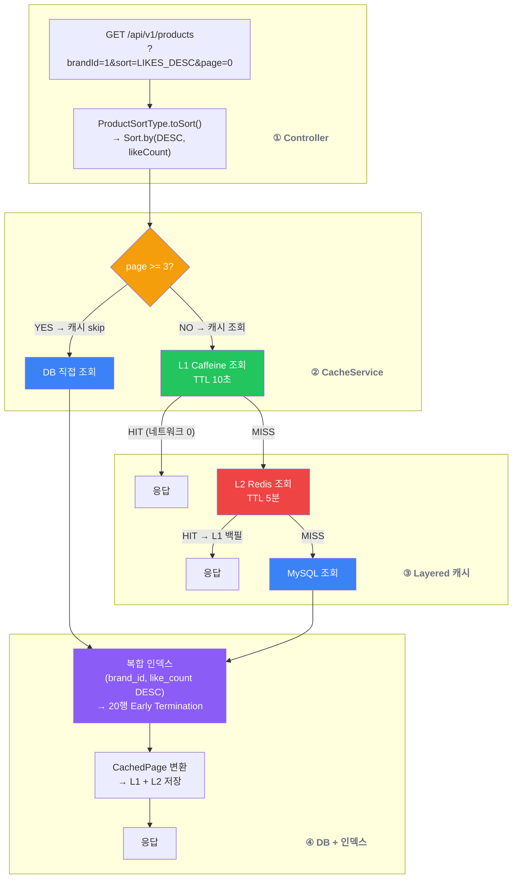
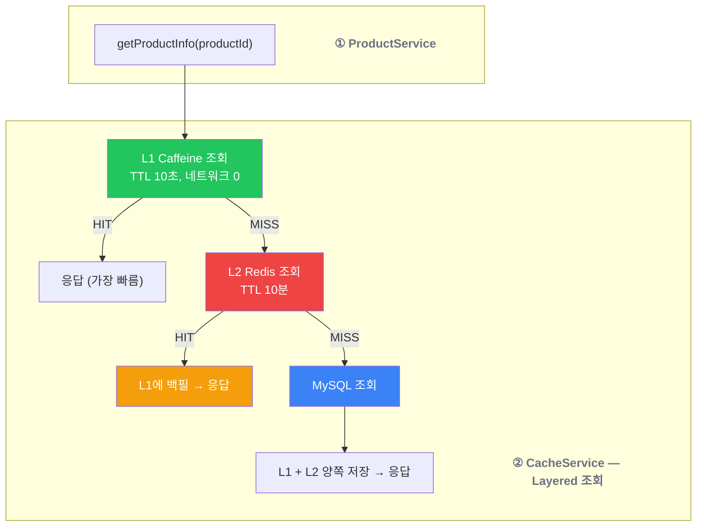
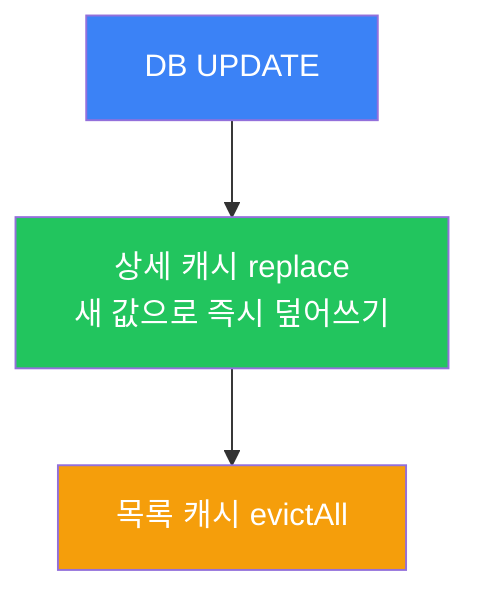
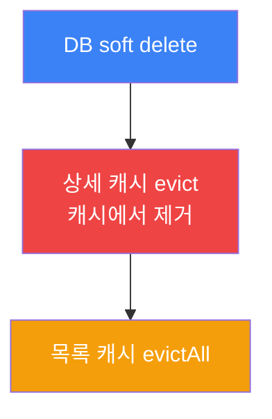
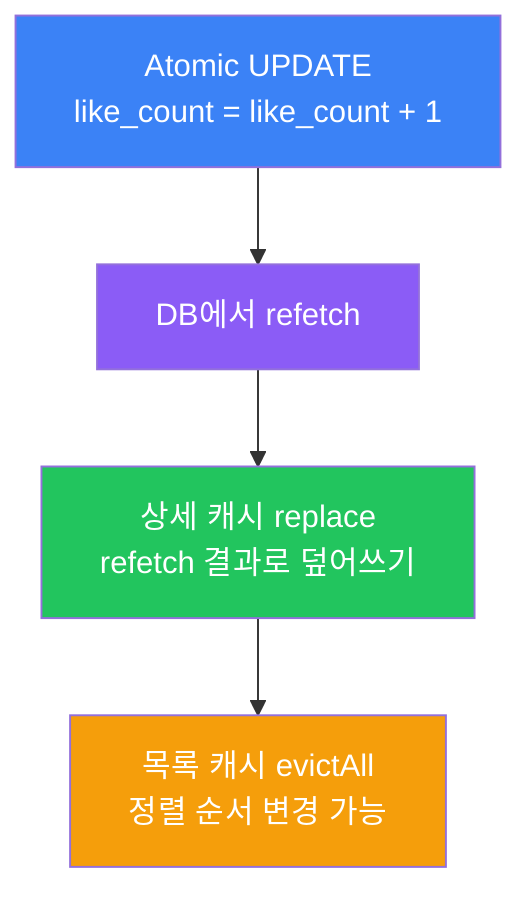

## 📌 Summary

- **배경**: 상품 목록 조회 성능 병목 — 인덱스 없이 브랜드 필터+정렬 시 Full Table Scan + filesort 발생, 좋아요순 정렬 시 JOIN+GROUP BY 비용, 반복 조회에 캐시 부재로 매번 DB 직접 접근
- **목표**: 복합 인덱스 + 비정규화 + Layered 캐시(Redis+Caffeine) 3단계 읽기 최적화
- **결과**: 복합 인덱스 3종 추가 (EXPLAIN 기준 5,000행→20행, 76~231배 개선), Layered 캐시 모드 도입 (K6 기준 avg 5.03ms, p95 8.80ms), Cache Stampede 방지를 위한 replace 전략 적용, 캐시 키 폭발 방지를 위한 페이지 제한(MAX_CACHED_PAGE=3) 도입


## 🧭 Context & Decision

### 문제 정의

- **배경**: 4주차까지 구현한 상품 도메인에 `brand_id` 단일 인덱스만 존재. 좋아요순 정렬은 4주차에 비정규화(`likeCount`)를 완료했지만 복합 인덱스는 미적용 상태. Redis 인프라(Master-Replica)는 구성되어 있었지만 캐시 로직은 없었음
- **핵심 문제**: 10만건 상품에서 브랜드 필터 + 정렬 시 filesort 발생, 동일 조회가 반복되어도 매번 DB를 직접 조회, 캐시 도입 시 직렬화/무효화/키 폭발 문제를 구조적으로 해결해야 함
- **성공 기준**: EXPLAIN ANALYZE로 인덱스 효과를 실측하고, K6 부하 테스트로 캐시 모드별 성능 비교를 수치로 확인한 상태

---

### 선택지와 결정

### 1. 복합 인덱스 3개 + 비정규화 — Early Termination으로 76~231배 개선

**고민**: 정렬 옵션(최신순/가격순/좋아요순)마다 `(brand_id, 정렬컬럼)` 복합 인덱스를 3개 추가하는 게 과도한 건 아닌지. "5,000건이면 filesort도 괜찮지 않나?"라는 생각도 있었지만, 행 크기·sort_buffer_size·동시 요청 수 등 변수가 많아 경험적 추정만으로는 판단할 수 없었다.

**결정**: 3개 전부 추가. EXPLAIN ANALYZE로 실측해서 76~231배 차이를 확인한 뒤 결정.

**핵심 원리**: 복합 인덱스가 있으면 B-Tree에서 brand_id 구간에 진입 시 이미 정렬된 상태이므로, LIMIT 20과 결합해 **20건만 읽고 즉시 중단**(Early Termination)한다. 인덱스가 없으면 brand_id로 필터된 5,000건을 전부 읽고 → `sort_buffer_size`(기본 256KB) 메모리에서 filesort(초과 시 디스크 임시 파일) → 20건 잘라냄. 전체 좋아요순(brand_id 필터 없음)은 좌측 프리픽스 규칙(Leftmost Prefix Rule)에 의해 복합 인덱스 활용 불가 — 이 한계를 인지한 상태로 현 시점에서는 단독 인덱스를 추가하지 않음.

**좋아요 비정규화와의 연결**: 좋아요를 별도 테이블에 정규화하면 `LEFT JOIN likes GROUP BY product_id ORDER BY COUNT(*) DESC` → temporary table + filesort가 확정적이고 인덱스 커버도 어렵다. 4주차에서 `Product.likeCount` 비정규화를 완료했고, 5주차에서 복합 인덱스 `(brand_id, like_count DESC)`와 연결해 단일 테이블 인덱스 스캔으로 해결했다. 쓰기 안전장치로는 Atomic Update(`like_count = like_count + 1`), `clearAutomatically = true`(JPA 1차 캐시 동기화), `GREATEST(like_count - 1, 0)`(음수 방지)를 적용. `Product.likeCount`는 `private set` 읽기 전용이고, 쓰기는 `@Modifying @Query` 네이티브 쿼리로만 수행하여 도메인 캡슐화를 유지한다.

**쓰기 비용 트레이드오프**: 인덱스 3개 추가로 INSERT/UPDATE마다 B-Tree 갱신이 발생하지만, 이커머스에서 상품 조회 빈도가  변경 빈도 보다 압도적으로 크기 떄문에 읽기 최적화가 우선이라 판단했다.

---

### 2. 캐시 방식 — RedisTemplate 직접 제어

**고민**: Spring의 `@Cacheable`로 간결하게 구현할지, `RedisTemplate`으로 직접 제어할지.

**결정**: RedisTemplate 직접 제어. `@Cacheable`은 AOP 기반으로 "메서드 결과를 캐시한다"는 단순 시나리오에 최적화되어 있지만, 이 프로젝트에서 필요한 동작들은 어노테이션으로 표현할 수 없다:
- **패턴 기반 `evictAll`**: 좋아요 변경 시 `product:list:*` 전체 목록 캐시 삭제
- **상세 캐시 `replace`**: 수정 시 evict 대신 새 값으로 즉시 덮어쓰기 (Cache Stampede 방지)
- **page >= 3 캐시 skip**: 조건부로 캐시 저장/조회를 건너뛰는 분기
- **Layered 모드 분기**: LOCAL/REDIS/LAYERED 3가지 모드에 따라 저장소를 다르게 선택

`PageImpl` 직렬화 문제(기본 생성자 없음 + `Pageable`/`Sort`가 인터페이스 타입 → Jackson 역직렬화 불가)도 순수 Kotlin data class인 `CachedPage` DTO로 해결했다. 캐시에 저장하는 데이터는 프레임워크에 의존하지 않는 구조가 원칙이다.

**캐시 3대 구성요소**:
- **삽입 (Cache-Aside)**: 조회 시 캐시에 없으면 DB에서 가져와 저장. 캐시 실패에도 DB fallback으로 서비스 정상 동작
- **TTL**: 상세 10분(변경 빈도 낮음) / 목록 5분(어떤 상품이든 변경 시 전체 목록 영향) / Local 10초(멀티 인스턴스 불일치 최소화). 솔직히 경험적 초기값이며, 운영 환경에서는 히트율과 DB 쿼리 수를 모니터링한 뒤 조정해야 한다
- **무효화**: TTL은 "보험"(능동적 무효화 실패해도 최대 TTL 후 갱신), evict/replace는 "능동적 대응"(데이터 변경 즉시 캐시 갱신) — 둘 다 있어야 안전

---

### 3. 캐시 모드 — K6 실측으로 Layered 선택

**고민**: Redis만 쓸지, Caffeine 로컬 캐시만 쓸지, 둘을 합칠지. 각각 트레이드오프가 달라서 "감"이 아니라 K6 부하 테스트로 실측.

**결정**: Layered (L1: Caffeine TTL 10초 → L2: Redis TTL 10분)를 기본값으로 채택. `CacheMode` enum + `@Value`로 런타임 전환 가능.

| 지표 | Redis | Local | Layered |
|------|-------|-------|---------|
| 목록 avg | 5.98ms | 5.40ms | **4.35ms** |
| 상세 avg | 7.47ms | **6.09ms** | 6.61ms |
| 전체 avg | 6.42ms | 5.60ms | **5.03ms** |

**왜 Layered가 목록 조회에서 압도적인가**: 동일 브랜드+정렬+페이지 조합은 10초 이내에 여러 사용자가 반복 요청할 확률이 높다. L1(Caffeine)에 캐시된 상태에서는 Redis 네트워크 왕복 자체가 생략되므로 avg 4.35ms를 달성. Redis 대비 **27.3% 개선**.

**왜 상세에서는 Local이 빠른가**: 단건 조회는 key(`productId`)가 단순하고 히트율이 높아 L1에서 거의 다 처리. Layered는 L1 미스 시 L2 확인이라는 추가 분기가 있어 순수 Local보다 0.52ms 느리지만(6.61ms vs 6.09ms), 트래픽의 70%를 차지하는 목록 조회에서 압도적이므로 전체 avg 기준 Layered가 최우수.

---

### 4. 캐시 무효화 — evict → replace 전환으로 Cache Stampede 방지

**문제 (Cache Stampede)**: 인기 상품의 캐시를 evict하면 캐시가 비어있는 상태에서 동시 100명이 조회 → 100개 DB 쿼리가 동시 발생 → DB 순간 과부하. 트래픽이 많은 인기 상품일수록 위험하다.

**해결**: 수정 시 캐시를 삭제하는 대신 DB에서 수정된 값을 refetch해서 즉시 덮어쓴다(`replace`). 캐시가 비는 구간이 0이므로 Stampede가 원천 차단된다. 삭제 시에만 `evict`를 사용하는데, 삭제된 상품은 replace할 값이 없고 캐시에 남아있으면 삭제된 상품이 조회되는 정합성 문제가 발생하기 때문이다.

**목록 캐시는 evictAll만 가능한 이유**: 상품 하나가 수정되면 어떤 `brandId × sort × page` 조합이 영향받는지 사전에 알 수 없다 — 가격이 바뀌면 가격순 전체가, 좋아요가 바뀌면 좋아요순 전체가 영향받을 수 있다. 영향 범위를 계산하는 비용이 전체 무효화 비용보다 크므로 `product:list:*` 패턴으로 전체를 무효화한다.

---

### 5. 목록 캐시 범위 — MAX_CACHED_PAGE=3으로 캐시 키 폭발 방지

**문제**: 캐시 키는 `product:list:{brandId}:{sort}:{page}:{size}` 형식으로, brandId(20) × sort(3) × page(무한) = 이론적으로 무한 증가 가능. 좋아요 하나 변경될 때마다 이 모든 키를 evict해야 하므로, 키가 많을수록 evict 자체가 병목이 된다.

**해결**: 이커머스에서 대부분의 사용자는 첫 1~3페이지만 탐색한다(80/20 법칙). page >= 3이면 `ProductCacheService`에서 캐시를 skip하고 DB 직접 조회. 캐시 키가 최대 180개(20×3×3)로 제한되어 evict 비용과 Redis/Local 메모리 사용이 대폭 감소한다. 3이라는 숫자는 경험적 초기값이므로, 운영 환경에서 페이지별 요청 분포를 모니터링하고 조정해야 한다.

**정책 분리 (SRP)**: `MAX_CACHED_PAGE` 상수와 페이지 제한 로직은 `ProductCacheService`에만 존재하고, `ProductService`는 캐시 정책을 모른다. 캐시 전략을 변경(3→5, 또는 제한 제거)해도 `ProductService`는 수정이 불필요하다 — 캐시 레이어의 변경이 비즈니스 레이어에 전파되지 않는 구조.


## 🏗️ Design Overview

### 변경 범위

- **커밋 수**: 13 커밋
- **변경 파일**: 23파일, +1,526 / -15
- **영향 모듈**: commerce-api (Product 도메인 전 레이어 + 캐시 인프라)
- **신규 추가**: `ProductSortType`, `CacheMode`, `ProductCacheService`, `ProductCacheRepository`, `ProductLocalCacheRepository`, `CachedPage`, K6 스크립트, seed SQL
- **변경**: `Product` (복합 인덱스), `ProductService` (캐시 통합), `ProductV1Controller`/`ApiSpec` (정렬 파라미터)
- **설계 문서**: 시퀀스 다이어그램 2개 추가 (8번: 캐시 조회, 9번: 캐시 무효화), 클래스 다이어그램/ERD 업데이트

### 주요 컴포넌트 책임

| 컴포넌트 | 책임 |
|----------|------|
| `ProductSortType` | 정렬 옵션 enum, `toSort()`로 Pageable에 Sort 주입 |
| `ProductCacheService` | 캐시 모드(LOCAL/REDIS/LAYERED) 분기, 캐시 조회/저장/무효화 조율 |
| `ProductCacheRepository` | Redis 캐시 CRUD (RedisTemplate + ObjectMapper) |
| `ProductLocalCacheRepository` | Caffeine 로컬 캐시 CRUD (TTL 10초) |
| `CachedPage` | Spring `PageImpl` 직렬화 문제 해결용 캐시 전용 DTO |
| `ProductService` | 캐시 hit/miss 분기 + DB fallback + 변경 시 캐시 무효화 |
| `Product` 엔티티 | 복합 인덱스 3개 (`@Table indexes`) |

### 테스트 구조

| 레이어 | 테스트 클래스 | 검증 내용 |
|--------|-------------|-----------|
| 단위 (Domain) | `ProductSortTypeTest` | enum별 toSort() 결과 검증 |
| 단위 (Service) | `ProductServiceTest` | 캐시 hit→DB 미호출, miss→DB+캐시 저장, 수정/삭제 시 무효화 호출 |
| 통합 | `ProductServiceIntegrationTest` | 정렬 순서, 캐시 hit/miss, 무효화 후 재조회 |
| 통합 (캐시) | `ProductCacheRepositoryTest` | Redis 캐시 저장/조회/무효화, TTL, CachedPage 직렬화 |
| E2E | `ProductV1ApiE2ETest` | sort 파라미터별 HTTP 응답, 브랜드 필터+정렬 조합 |


## 🔁 Flow Diagram

### 상품 목록 조회 — 캐시 + 인덱스 통합 흐름



### 상품 상세 조회 — Layered 캐시 L1→L2→DB

> [시퀀스 다이어그램 #8: 상품 상세 조회 - 캐시 (C05)](../design/02-sequence-diagrams.md#8-상품-상세-조회---캐시-c05)



### 캐시 무효화 전략 — 수정/삭제/좋아요 3가지 경로

> [시퀀스 다이어그램 #9: 상품 수정 - 캐시 무효화 (A09)](../design/02-sequence-diagrams.md#9-상품-수정---캐시-무효화-a09)

**수정 — replace (Stampede 방지)**



**삭제 — evict (replace할 값 없음)**



**좋아요 — Atomic UPDATE + replace**




## 📊 성능 측정 결과

### EXPLAIN ANALYZE — 복합 인덱스 전/후 비교

**테스트 환경**: MySQL 8.0.45, 상품 100,000건, 브랜드 20개 (브랜드당 약 5,000건)

| 쿼리 | 인덱스 | 인덱스 없음 (행/시간) | 인덱스 있음 (행/시간) | 개선 | filesort |
|------|--------|---------------------|---------------------|------|----------|
| `WHERE brand_id=1 ORDER BY created_at DESC` | `(brand_id, created_at DESC)` | 5,000행 / 7.58ms | **20행 / 0.08ms** | **95배** | 제거됨 |
| `WHERE brand_id=1 ORDER BY price ASC` | `(brand_id, price ASC)` | 5,000행 / 13.9ms | **20행 / 0.06ms** | **231배** | 제거됨 |
| `WHERE brand_id=1 ORDER BY like_count DESC` | `(brand_id, like_count DESC)` | 5,000행 / 5.34ms | **20행 / 0.07ms** | **76배** | 제거됨 |
| `ORDER BY like_count DESC` (brand_id 필터 없음) | - | 100,000행 / 40.1ms | 100,000행 / 44.2ms | 효과 없음 | 그대로 |

**핵심**: 3개 쿼리 모두 동일한 패턴 — 복합 인덱스가 있으면 B-Tree에서 brand_id 구간에 진입 후 정렬된 순서로 20건만 읽고 중단(Early Termination). 없으면 5,000건 전부 읽고 filesort 후 20건 잘라냄. 전체 좋아요순은 좌측 프리픽스 규칙에 의해 복합 인덱스 활용 불가.

---

### K6 부하 테스트 — 캐시 모드별 상세 비교

**테스트 환경**: 100 VUs, 30초, 워밍업 10초 선행, 70% 목록 조회(브랜드별, 랜덤 정렬/페이지) + 30% 상세 조회(랜덤 상품 ID), 상품 100,000건, 브랜드 20개

#### 전체 성능 비교

| 지표 | Redis | Local (Caffeine) | Layered (Local+Redis) | Layered vs Redis 개선 |
|------|-------|-------------------|----------------------|----------------------|
| **avg 응답** | 6.42ms | 5.60ms | **5.03ms** | **-21.7%** |
| **p95 응답** | 11.77ms | 10.43ms | **8.80ms** | **-25.2%** |
| **처리량 (rate)** | 937/s | 944/s | **950/s** | +1.4% |
| **총 요청 수** | 28,156 | 28,400 | **28,555** | +1.4% |
| **에러율** | 0.00% | 0.00% | 0.00% | - |

#### 엔드포인트별 성능 비교

| 엔드포인트 | 지표 | Redis | Local | Layered | 최우수 모드 |
|-----------|------|-------|-------|---------|-----------|
| **목록 조회** (70%) | avg | 5.98ms | 5.40ms | **4.35ms** | Layered (**-27.3%** vs Redis) |
| | p95 | 10.86ms | 10.22ms | **7.02ms** | Layered (**-35.4%** vs Redis) |
| **상세 조회** (30%) | avg | 7.47ms | **6.09ms** | 6.61ms | Local (**-18.5%** vs Redis) |
| | p95 | 13.53ms | **10.81ms** | 10.74ms | Layered (**-20.6%** vs Redis) |

#### 모드별 동작 원리와 결과 해석

**Redis 모드 — 매 요청마다 네트워크 왕복**

모든 캐시 조회가 Redis를 거친다. 요청 1건당 `Application → Redis → (직렬화/역직렬화)` 네트워크 왕복이 발생한다. 로컬 환경에서도 Redis 왕복 비용이 avg 기준 1~2ms를 차지하며, 이것이 다른 모드 대비 느린 원인이다. 다만 서버가 여러 대일 때 캐시 일관성이 가장 높다.

**Local 모드 — JVM 힙에서 직접 접근**

Caffeine 캐시가 JVM 힙 메모리에 존재하므로 네트워크 비용이 0이다. 상세 조회에서 avg 6.09ms로 가장 빠른 이유는, 단건 key(`productId`)의 히트율이 높아 거의 모든 요청이 메모리에서 처리되기 때문이다. 단점은 서버 인스턴스마다 독립적인 캐시를 가지므로, 멀티 인스턴스 환경에서 데이터 불일치가 발생한다.

**Layered 모드 — L1(Local) + L2(Redis) 계층 구조**

L1(Caffeine, TTL 10초) → L2(Redis, TTL 10분) 순서로 조회한다. L1 히트 시 네트워크 왕복 0, L1 미스 시 L2에서 가져와 L1에 백필한다.

```
클라이언트 요청
      │
      ▼
┌─────────────────────────┐
│  L1 로컬 캐시 (Caffeine) │  ← TTL 10초, 네트워크 0
│  히트율: 92% (목록)       │
└────────┬────────────────┘
         │ L1 미스 (8%)
         ▼
┌─────────────────────────┐
│  L2 Redis 캐시           │  ← TTL 10분, 네트워크 왕복 1~2ms
│  히트율: 64% (L1 미스 중) │
└────────┬────────────────┘
         │ L2 미스 (전체의 ~3%)
         ▼
┌─────────────────────────┐
│  DB (MySQL)              │  ← 복합 인덱스 적용
│  조회 후 L1 + L2에 저장   │
└─────────────────────────┘
```

**캐시 히트율 — 히트율이 응답 시간의 차이를 설명한다**

| 캐시 | Redis | Local | Layered (L1 + L2) | DB 도달률 |
|------|-------|-------|-------------------|----------|
| **목록 캐시** | 100% | 92% | **97%** (L1 92% + L2 64% of 미스) | Layered **~3%** |
| **상세 캐시** | 4.7% | 1.7% | **12%** (L1 1.7% + L2 10.4% of 미스) | 대부분 DB |

- **Local 목록 히트율 92%의 한계**: TTL 10초마다 캐시 만료 → 8% 미스가 DB 직접 조회 → p95를 끌어올려 Redis(10.86ms)와 큰 차이 없음
- **Layered가 97%인 이유**: L1 만료되어도 L2(Redis, TTL 5분)가 받아줌. **DB까지 가는 요청은 전체의 ~3%에 불과** → 목록 p95 **7.02ms**로 가장 낮음
- **상세 히트율이 낮은 이유**: 10만 개 상품 중 랜덤 조회 → 동일 상품 반복 확률이 낮음. 다만 Layered는 L2가 소수의 인기 상품을 캐싱해 꼬리 지연을 줄여줌

#### Layered를 기본값으로 선택한 근거

| 기준 | Redis | Local | Layered | 판정 |
|------|-------|-------|---------|------|
| 목록 조회 성능 (트래픽의 70%) | 5.98ms | 5.40ms | **4.35ms** | Layered 압도적 |
| 상세 조회 성능 (트래픽의 30%) | 7.47ms | **6.09ms** | 6.61ms | Local 최우수, Layered 준수 |
| 멀티 인스턴스 일관성 | 즉시 일관 | 불일치 | **10초 이내 수렴** | Layered 균형 |
| 구현 복잡도 | 낮음 | 낮음 | 높음 | Redis/Local 유리 |
| 캐시 실패 시 안전망 | 없음 (DB fallback만) | 없음 | **L2가 L1의 백업** | Layered |

트래픽의 70%를 차지하는 목록 조회에서 Layered가 압도적이고, 30%인 상세 조회에서도 Local 대비 0.52ms 차이로 허용 범위 내다. 가중 평균으로 보면 Layered가 전체 avg(5.03ms)에서 최우수이며, 멀티 인스턴스 환경에서 L1의 짧은 TTL(10초)로 불일치를 최소화할 수 있어 **실용적 최적해**로 판단했다.

#### 한계와 추후 개선

- **캐시 히트율 심화 분석**: L1 92% / L2 64%는 측정했지만, 시간대별·브랜드별 히트율 분포를 확인하면 TTL 최적화에 더 유용할 것이다
- **TTL 튜닝 미완료**: 10분/5분/10초는 경험적 초기값. 히트율과 DB 쿼리 수를 모니터링한 뒤 데이터 기반으로 조정해야 한다
- **워밍업 영향**: 10초 워밍업 후 측정했지만, 콜드 스타트 시나리오(배포 직후 등)의 성능은 별도 측정이 필요하다
