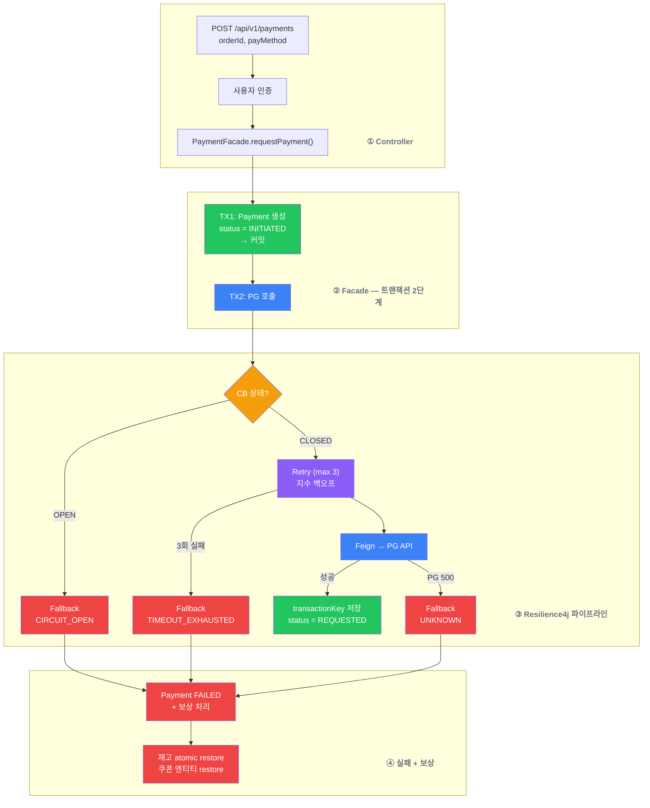
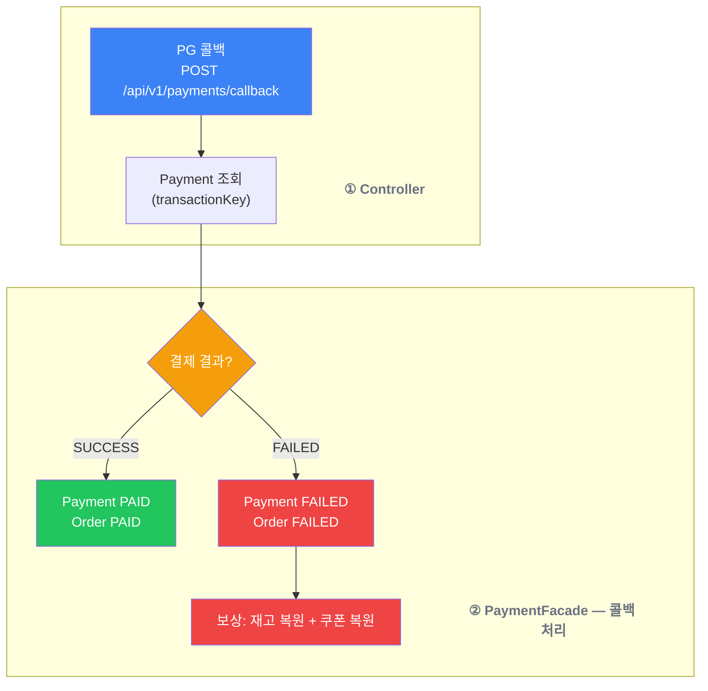
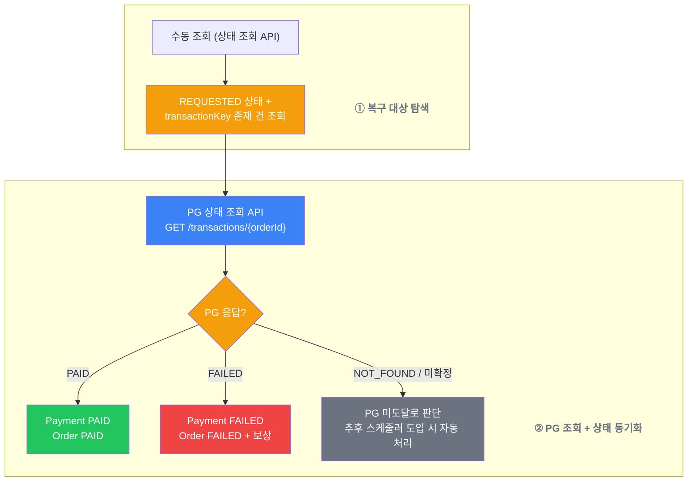
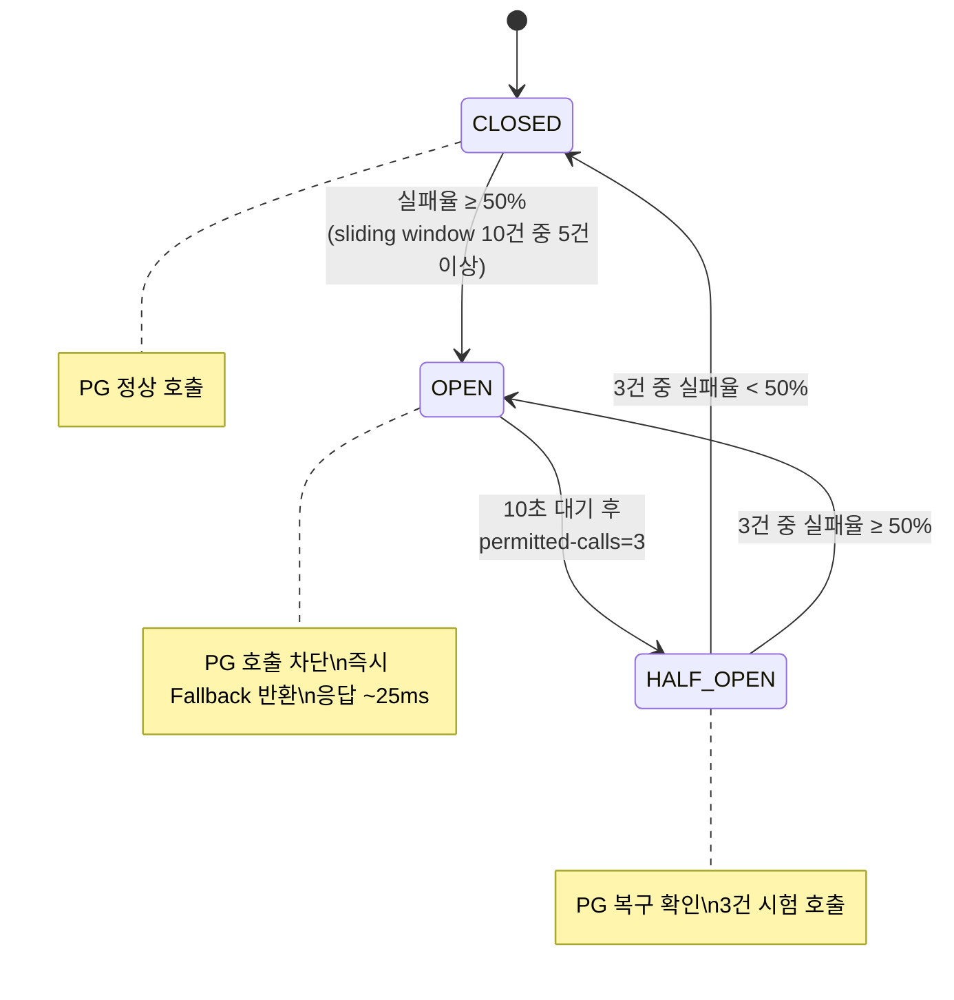

## 📌 Summary

- **배경**: 커머스 서비스에서 외부 PG 결제 연동 필요. 외부 시스템 장애 시 스레드 풀 고갈 → 장애 전파 위험
- **목표**: Feign Client + Resilience4j(CB/Retry/Fallback) 기반 PG 결제 연동, 결제 실패 시 보상 처리(재고/쿠폰 복원), 설정값을 실측 데이터로 도출
- **결과**: pg_communication_logs와 Actuator를 활용해 PG 실측 데이터(정상 응답 ~413ms, 실패율 ~40%) 기반으로 Resilience4j 설정값을 도출하고, pg-simulator 수동 검증으로 CB/Retry 동작을 직접 확인. 이 과정에서 프레임워크 내부 동작 관련 설정 버그 5건을 발견·수정했으며, CB OPEN 시 PG 호출 차단으로 응답 시간 366ms→25ms(14.6배 감소) 달성


## 🧭 Context & Decision

### 문제 정의

- **배경**: 5주차까지 구현한 주문 도메인에 결제 연동이 없는 상태. 외부 PG 시스템은 네트워크 지연, 타임아웃, 서버 다운 등 장애가 발생할 수 있으며, 이를 대비하지 않으면 스레드 풀 고갈로 전체 서비스가 마비될 수 있다
- **핵심 문제**: PG 호출 실패 시 결제 레코드가 유실되지 않아야 하고, 재고·쿠폰 보상이 안전하게 이루어져야 하며, Resilience4j 설정이 의도대로 동작하는지 검증할 수단이 필요하다
- **성공 기준**:
  - PG 장애(다운/500/타임아웃) 상황에서 결제 레코드가 유실되지 않고, 재고·쿠폰 보상이 정확히 수행된다
  - Retry는 네트워크 에러(ConnectException, SocketTimeout)에만 동작하고, PG 500에는 즉시 실패한다
  - CB가 PG 장애 지속 시 OPEN으로 전이되어 불필요한 PG 호출을 차단하고, PG 복구 시 자동으로 CLOSED로 복구된다
  - 모든 설정값에 pg_communication_logs 실측 데이터 기반 근거가 있다

---

### 선택지와 결정

### 1. 트랜잭션 경계 분리 — PG 호출을 트랜잭션 밖으로

**고민**: Payment 생성과 PG 호출이 하나의 `@Transactional` 안에 있으면, PG 타임아웃 시 트랜잭션 전체 롤백 → Payment 레코드 소실 → 콜백 매칭 불가. 결제 기록이 남지 않으면 PG에서 콜백이 와도 어떤 결제인지 찾을 수 없다.

**결정**: 트랜잭션 분리. TX1(Payment INITIATED 커밋) → PG 호출(트랜잭션 밖) → TX2(PG 결과 반영: REQUESTED 전이 + transactionKey 저장 또는 FAILED + 보상). PG 실패해도 Payment는 INITIATED 상태로 DB에 남아 복구 가능.

**수동 검증에서 발견한 함정**: 트랜잭션 분리 후에도 PG 실패 시 Payment가 REQUESTED 상태로 남는 버그가 있었다. `TransactionTemplate.execute` 블록 안에서 `payment.markFailed()` 호출 후 예외를 throw하면, TransactionTemplate이 트랜잭션 전체를 롤백하므로 `markFailed()`의 변경도 함께 롤백된다. 보상 처리(재고/쿠폰 복원)도 같은 트랜잭션이므로 전부 취소.

```
TransactionTemplate.execute {
  payment.markFailed()   ← dirty checking으로 변경 예약
  compensateOrder()      ← 재고/쿠폰 복원 예약
  throw FeignException   ← 트랜잭션 롤백 → 위 변경 모두 취소!
}
```

**해결**: PG 호출 실패를 "에러"가 아니라 "결제 실패라는 비즈니스 결과"로 처리. catch 안에서 예외를 throw하지 않고 실패 상태를 결과값으로 반환, 상위에서 SERVICE_UNAVAILABLE 응답을 구성하는 방식으로 변경. 이 버그는 Mock 기반 단위 테스트에서는 절대 발견되지 않으며, 실제 DB + 트랜잭션이 있어야 보인다 — 멘토님이 "눈으로 보는 테스트가 중요하다"고 강조한 이유를 체감한 지점이다.

---

### 2. Resilience4j 설정값 — 실측 데이터로 도출

감이 아니라 `pg_communication_logs` + Actuator 실측으로 모든 설정값을 결정했다. "처음 설정한 값 → 테스트 결과 → 조정 여부"를 기록하며 튜닝했고, 이 과정에서 5건의 설정 버그를 발견했다.

#### Timeout 설정

| 설정 | 값 | 실측 근거 |
|------|-----|----------|
| connectTimeout | 1s | PG 정상 시 TCP 연결 수십ms, Connection refused 시 2~9ms 즉시 반환. 정상의 ~20배로 충분한 여유 |
| readTimeout | 3s | PG 정상 응답 평균 ~413ms, 최대 562ms. 최대값의 ~5.3배. 이보다 길면 스레드 점유 과다 |

#### Retry 설정

| 설정 | 초기값 | 최종값 | 변경 근거 |
|------|--------|--------|----------|
| max-attempts | 3 | 3 (유지) | 총 소요 1.78s, 사용자 체감 한계(5~10s) 이내 |
| wait-duration | 500ms | 500ms (유지) | 지수 백오프 기준값 |
| retry-exceptions | `SocketTimeoutException`, `ConnectException` | **`feign.RetryableException`** | Feign이 예외를 `RetryableException`으로 래핑하므로 원본 타입 매칭 안 됨 **(버그 #2)** |
| ignore-exceptions | `CoreException`, `FeignException` | **`CoreException`만** | `RetryableException extends FeignException` → ignore가 retry보다 우선 → Retry 전혀 안 됨 **(버그 #3)** |
| enable-exponential-backoff | 미설정 | **true** | multiplier만 지정하면 무시됨. 로그에서 재시도 간격이 고정 500ms → 수정 후 500ms→1000ms로 정상 **(버그 #5)** |

**Retry 실측 검증**:

| 시나리오 | pg_communication_logs 건수 | 재시도 간격 | 총 소요 | 판정 |
|----------|---------------------------|-----------|---------|------|
| PG 다운 (ConnectException) | 3건 | 1→2: ~517ms, 2→3: ~1017ms | ~1.78s | Retry 정상 (지수 백오프 적용) |
| PG 500 (FeignException) | 1건 | - | 즉시 | Retry 안 함 (의도한 동작) |
| PG 정상 | 1건 | - | ~413ms | Retry 불필요 |

#### CircuitBreaker 설정

| 설정 | 값 | 실측 근거 |
|------|-----|----------|
| sliding-window-type | COUNT_BASED | PG 결제는 트래픽이 비교적 일정하고 장애 시 빠른 감지가 중요. TIME_BASED는 트래픽 편차가 큰 서비스(낮 폭주, 새벽 한산)에 적합 |
| sliding-window-size | 10 | 최근 10건 기준 실패율 계산 |
| minimum-number-of-calls | 5 | 5건째부터 실패율 계산 시작 확인 |
| failure-rate-threshold | 50% | PG 정상 실패율 ~40%(500 에러), threshold 50%와 10%p 여유 → 정상 시 CB 오탐 없음 확인 |
| slow-call-duration-threshold | 3s | readTimeout(3s)과 동일. 이보다 오래 걸리면 타임아웃 에러로 먼저 잡히므로 slowCall은 "타임아웃 직전의 느린 응답"을 감지하는 역할 |
| slow-call-rate-threshold | 50% | failureRateThreshold와 독립 판단 — 에러가 아닌 느린 응답만으로도 CB가 열릴 수 있음 |
| wait-duration-in-open-state | 10s | OPEN 후 10초 대기 → 다음 요청 시 HALF_OPEN 전이 확인 |
| permitted-calls-in-half-open | 3 | PG 정상: 3건 중 2건 성공 → CLOSED 복구. PG 다운: 3건 실패 → 다시 OPEN |

**CB 상태 전이 실측**:

| 전이 | 조건 | 테스트 결과 |
|------|------|-----------|
| CLOSED → OPEN | failureRate ≥ 50% | PG 다운 시 5건째 OPEN 전이 확인 |
| OPEN → HALF_OPEN | 10s 경과 + 요청 도착 | 10초 대기 후 요청 시 HALF_OPEN 확인 (자동 전이 아님, 요청이 와야 전이) |
| HALF_OPEN → CLOSED | 3건 중 과반 성공 | PG 정상 복구 후 2/3 성공 → CLOSED 복구 |
| HALF_OPEN → OPEN | 3건 중 과반 실패 | PG 다운 유지 시 3/3 실패 → OPEN 재전환 |

**Aspect 순서 변경 (버그 #4)**:

| 순서 | 동작 | 문제 |
|------|------|------|
| 기본 (Retry 바깥, CB 안쪽) | CB fallback이 CoreException throw → Retry는 CoreException(ignore)만 보고 재시도 안 함 | Retry가 원본 예외를 못 봄 |
| **CB(1) → Retry(2)** | Retry가 PG 호출을 직접 감싸고 3회 재시도 → 최종 실패 시 CB가 fallback 호출 | **정상** |

#### 5건의 설정 버그 요약

| # | 발견 경위 | 버그 | 수정 |
|---|----------|------|------|
| 1 | local 프로파일에서 설정 미적용 | YAML이 prd에만 존재 | 공통 영역으로 이동 |
| 2 | PG 다운인데 로그 1건 → Retry 안 됨 | `ConnectException`이 `RetryableException`으로 래핑되어 매칭 안 됨 | retry-exceptions를 `feign.RetryableException`으로 변경 |
| 3 | 버그 #2 수정 후에도 Retry 안 됨 | `RetryableException extends FeignException` → ignore 우선 평가로 Retry 차단 | ignore에서 `FeignException` 제거 |
| 4 | CB fallback 후 Retry가 동작 안 함 | Retry가 바깥, CB가 안쪽 → Retry가 원본 예외를 못 봄 | `circuit-breaker-aspect-order: 1`, `retry-aspect-order: 2` |
| 5 | 재시도 간격이 고정 500ms | `enable-exponential-backoff: true` 누락 | 플래그 추가 → 500ms→1000ms 지수 백오프 확인 |

**Fallback 타입 구분**: 예외 타입 기반으로 장애 원인을 즉시 파악할 수 있게 분기했다.

| 상황 | Fallback 타입 | 운영 대응 |
|------|--------------|----------|
| CB OPEN (PG에 요청 자체 안 감) | `CIRCUIT_OPEN` | PG 복구 후 재시도 가능 |
| Retry 소진 — 연결 실패 | `CONNECTION_REFUSED` | PG 서버 상태 확인 필요 |
| Retry 소진 — 타임아웃 | `TIMEOUT_EXHAUSTED` | PG 조회 API로 실제 처리 여부 확인 필요 |
| Retry 소진 — 기타 RetryableException | `RETRYABLE_EXHAUSTED` | 예상치 못한 Feign 재시도 가능 에러 |
| PG 500 (Retry 안 함) | `UNKNOWN` | PG 서버 문제, 즉시 실패 처리 |

---

### 3. PG 통신 로그 — 왜 쌓아야 했나

**출발점**: 멘토링에서 "PG는 우리가 통제할 수 있는 부분이 아니다"라는 피드백이 있었다. 아무리 CB/Retry를 잘 설정해도 외부 시스템에서 장애가 나는 건 우리가 어떻게 할 수 없다. 그렇다면 우리가 할 수 있는 건 **"무슨 일이 있었는지 정확히 남기는 것"**이다. 운영 중에 "이 결제 건이 PG에 요청이 갔는지", "응답이 왔는지", "몇 ms 걸렸는지"를 추적해야 하는 상황은 반드시 온다 — 고객 클레임, 정산 불일치, PG사와의 책임 구분 등. 콘솔 로그는 휘발되고 검색이 어렵지만, DB에 구조화해서 남기면 orderId 하나로 해당 결제의 전체 통신 이력을 즉시 조회할 수 있다.

**결정**: PG 통신마다 요청/응답을 `pg_communication_logs` 테이블에 자동 기록. HTTP 메서드, URL, 상태 코드, 소요 시간, 에러 메시지를 남겨서 운영 시 통신 이력 추적 + Resilience4j 설정 검증 두 가지 목적을 동시에 달성했다.

**운영 관점의 효과**: 특정 결제 건에 대해 "PG에 요청이 몇 번 갔고, 각각 어떤 응답을 받았는지"를 DB 쿼리 한 줄로 확인 가능. PG사와 장애 원인을 협의할 때 "우리 쪽 로그에는 14:23:05에 POST 요청을 보냈고, 3초 후 타임아웃"이라는 객관적 근거를 제시할 수 있다.

**개발 관점의 효과**: 이 로그 덕분에 Resilience4j 설정 버그 5건을 발견할 수 있었다. "PG 다운인데 로그가 1건만 찍힌다 → Retry가 안 되고 있다", "재시도 간격이 500ms로 고정 → 지수 백오프가 안 먹고 있다" 같은 발견이 가능했다. Actuator의 CB 엔드포인트와 함께 "설정이 의도대로 동작하는지" 검증하는 핵심 수단이 됐다.

**구현**: AOP(`@Around PgPaymentClient.requestPayment/getPaymentStatus`)로 Feign 파이프라인과 분리, `REQUIRES_NEW` 트랜잭션으로 결제 롤백과 무관하게 로그 독립 저장. fallback 메서드는 AOP 대상에서 제외하여 불필요한 로그 기록 방지.


## 🏗️ Design Overview

### 변경 범위

- **커밋 수**: 14 커밋
- **변경 파일**: 61파일, +3,640 / -27
- **영향 모듈**: commerce-api (Payment 도메인 전 레이어 + PG 연동 인프라)
- **신규 추가**: Payment 도메인(Entity/Repository/Service/Facade), PG 연동(FeignClient/Config/AOP), 결제 API(Controller/ApiSpec/DTO)
- **변경**: Order(상태 추가), application.yml(Resilience4j 설정)

### 주요 컴포넌트 책임

| 컴포넌트 | 책임 |
|----------|------|
| `PaymentFacade` | 트랜잭션 2단계 분리, PG 호출, 콜백/폴링 처리, 보상 로직 조율 |
| `PaymentService` | Payment CRUD, 상태 전이 관리 |
| `PgPaymentClient` | CB + Retry + Fallback 적용, Fallback 타입 분기 |
| `PgClient` | Feign Client 인터페이스 (결제 요청, 상태 조회) |
| `PgClientConfig` | connectTimeout/readTimeout, Retryer.NEVER_RETRY |
| `PgCommunicationLoggingAspect` | PG 통신 로그 AOP 기록 (REQUIRES_NEW) |

### 테스트 구조

| 레이어 | 테스트 클래스 | 검증 내용 |
|--------|-------------|-----------|
| 단위 (Domain) | `OrderTest`, `PaymentTest` | 상태 전이, 소유자 검증, Snowflake ID |
| 단위 (Service) | `PaymentServiceTest`, `PaymentFacadeTest` | Mock 기반 서비스 로직, 보상 호출 검증 |
| 통합 | `PaymentServiceIntegrationTest` | 실제 DB 기반 Payment CRUD, 상태 전이 |
| 통합 | `PaymentFacadeIntegrationTest` | 트랜잭션 경계 검증, 보상 로직 통합 검증 |
| 통합 | `PgPaymentClientResilienceTest` | CB 상태 전이, Retry 동작, Fallback 타입 |
| 통합 | `PgCommunicationLoggingAspectIntegrationTest` | PG 로그 저장 검증 |
| E2E | `PaymentV1ApiE2ETest` | HTTP 전체 흐름 (결제 요청, 콜백, 상태 조회) |


## 🔁 Flow Diagram

### 결제 요청 흐름 — 트랜잭션 2단계 분리 + Resilience4j



### 콜백 흐름 — PG 결제 결과 수신 + 보상



### 폴링 복구 흐름 — 콜백 미도착 시 상태 확인



### CB 상태 전이 다이어그램




## 📊 성능 측정 결과

**측정 환경**: commerce-api(8080) + pg-simulator(8082) + MySQL 로컬 Docker 구성, .http 파일로 단건 호출 5회 평균, Actuator `/actuator/circuitbreakers`로 CB 상태 확인

### CB OPEN 시 응답 시간 비교

| 상황 | 응답 시간 | 비고 |
|------|----------|------|
| PG 정상 (CB CLOSED) | ~366ms | PG 네트워크 지연 포함 |
| CB OPEN | ~25ms | PG 호출 차단, 즉시 Fallback |
| **차이** | **~14.6배 감소** | 장애 시 스레드 점유 대폭 감소 |

### Retry 동작 측정

| 상황 | 소요 시간 | Retry 횟수 | 비고 |
|------|----------|-----------|------|
| Retry 3회 총 소요 | ~1.78s | 3회 | 지수 백오프 포함 |
| PG 500 시 | 즉시 실패 | 0회 | Retry 안 함, 로그 1건 |
| PG 타임아웃 시 | ~1.78s | 3회 | 재시도 후 Fallback |

**핵심**: CB OPEN 상태에서는 PG 호출 자체를 차단하므로 스레드가 366ms 동안 블로킹되는 것을 방지한다. 이는 동시 요청이 많을 때 스레드 풀 고갈을 막는 핵심 메커니즘이다. Retry는 타임아웃/연결 실패에만 동작하며, PG 500 같은 서버 에러에는 즉시 실패 처리한다.

### PG 통신 로그 기반 설정 검증

```
┌─────────────────────────────────────────────────────────────────┐
│  pg_communication_logs 테이블                                     │
│                                                                   │
│  시나리오: PG 다운 시 Retry 3회 동작 확인                            │
│  ┌────────┬──────────┬────────┬───────────┬──────────────────┐  │
│  │ 시각    │ method   │ status │ duration  │ error            │  │
│  ├────────┼──────────┼────────┼───────────┼──────────────────┤  │
│  │ :00.00 │ POST     │ null   │ 1000ms    │ ConnectException │  │
│  │ :00.50 │ POST     │ null   │ 1000ms    │ ConnectException │  │
│  │ :01.50 │ POST     │ null   │ 1000ms    │ ConnectException │  │
│  └────────┴──────────┴────────┴───────────┴──────────────────┘  │
│  → 로그 3건 확인 → Retry가 정상 동작 중                              │
│                                                                   │
│  시나리오: PG 500 시 Retry 미동작 확인                               │
│  ┌────────┬──────────┬────────┬───────────┬──────────────────┐  │
│  │ 시각    │ method   │ status │ duration  │ error            │  │
│  ├────────┼──────────┼────────┼───────────┼──────────────────┤  │
│  │ :00.00 │ POST     │ 500    │ 413ms     │ PG Server Error  │  │
│  └────────┴──────────┴────────┴───────────┴──────────────────┘  │
│  → 로그 1건 → Retry 미동작 확인 (의도한 동작)                        │
└─────────────────────────────────────────────────────────────────┘
```

### 최종 설정값 요약

```yaml
feign:
  connectTimeout: 1s          # 정상 수십ms × ~20배
  readTimeout: 3s              # 정상 최대 562ms × ~5.3배

resilience4j:
  circuitbreaker:
    circuit-breaker-aspect-order: 1
    instances:
      pgCircuit:
        sliding-window-type: COUNT_BASED
        sliding-window-size: 10
        minimum-number-of-calls: 5
        failure-rate-threshold: 50       # 정상 실패율 ~40% + 10%p 여유
        wait-duration-in-open-state: 10s
        permitted-number-of-calls-in-half-open-state: 3
        slow-call-duration-threshold: 3s
        slow-call-rate-threshold: 50
  retry:
    retry-aspect-order: 2
    instances:
      pgRetry:
        max-attempts: 3                  # 총 ~1.78s (backoff 포함)
        wait-duration: 500ms
        enable-exponential-backoff: true
        exponential-backoff-multiplier: 2
        retry-exceptions:
          - feign.RetryableException     # timeout/connection만 Retry
        ignore-exceptions:
          - com.loopers.support.error.CoreException
```

### 한계와 추후 개선

- **실측 환경 한계**: 로컬 Docker 기반 PG Mock 서버로 측정. 실제 PG 네트워크 환경에서는 지연 패턴이 다를 수 있다
- **CB 임계값 튜닝**: failure-rate-threshold 50%는 초기값. 운영 환경에서 정상/비정상 실패율 분포를 모니터링한 뒤 조정 필요
- **폴링 복구 스케줄러 미구현**: 현재 콜백 미도착 건은 상태 조회 API로 수동 확인만 가능. INITIATED 상태로 오래 남은 건을 자동 복구하는 스케줄러 도입 필요
- **보상 처리 실패**: 현재 보상 로직(재고/쿠폰 복원) 자체가 실패하는 케이스에 대한 재시도 메커니즘은 미구현. 추후 이벤트 기반 비동기 보상이나 Dead Letter Queue 도입을 고려해야 한다
- **콜백 인증 미구현**: PG 콜백 엔드포인트에 IP 화이트리스트나 시그니처 검증이 없음. PG 시뮬레이터 환경이므로 현재는 불필요하나, 운영 시 외부 악의적 콜백 방어 필요
