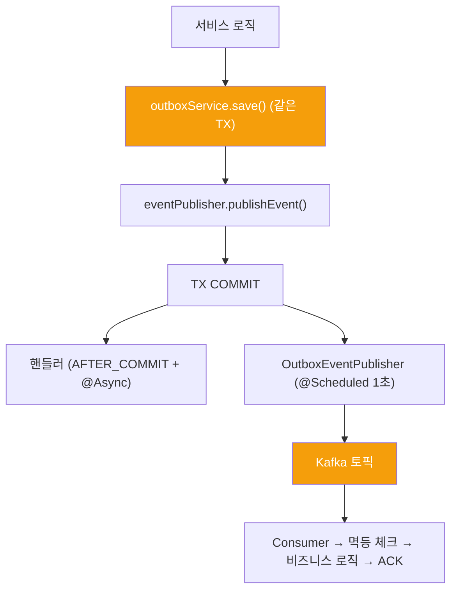
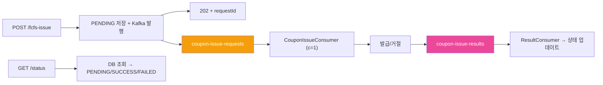

## 📌 Summary

- **배경**: 주문/결제/좋아요 흐름에서 부가 로직(로깅, 집계)이 핵심 트랜잭션에 묶여 있어, 부가 로직 실패 시 핵심도 롤백되고 트랜잭션이 길어져 DB 락 유지 시간 증가
- **목표**: ApplicationEvent로 핵심/부가 로직 분리, Kafka 파이프라인으로 시스템 간 이벤트 전파, 선착순 쿠폰 발급 비동기 처리
- **결과**: Step 1~7 점진적 구현 완료 — 이벤트 분리, Outbox + Kafka, FCFS 쿠폰, 배치 Consumer, DLQ, E2E 테스트, Outbox 정리 스케줄러

## 🧭 Context & Decision

### 문제 정의

- **현재 동작**: 좋아요 → likeCount 증가, 주문 → 로깅 등 부가 로직이 하나의 트랜잭션 안에서 동기 실행
- **문제**: 부가 로직 실패 시 핵심 롤백, 트랜잭션 비대화로 TPS 하락, 시스템 간 이벤트 전파 수단 부재
- **성공 기준**: 집계 실패와 무관하게 좋아요 성공, Outbox → Kafka 원자적 발행, 선착순 쿠폰 수량 초과 발급 없음

### 선택지와 결정

#### 1. 이벤트 리스너 타입 — AFTER_COMMIT vs @EventListener

- **A**: 모든 이벤트에 `@TransactionalEventListener(AFTER_COMMIT)` 통일
- **B**: 쓰기 트랜잭션은 `AFTER_COMMIT`, readOnly는 `@EventListener`로 트랜잭션 성격에 맞게 분리
- **결정**: B
- **근거**: `AFTER_COMMIT`은 트랜잭션 커밋 이후에 실행되므로 "커밋이 확정된 데이터만 후속 처리"에 적합. 그런데 readOnly 트랜잭션(상품 조회 → PRODUCT_VIEWED 이벤트)은 보호할 쓰기가 없으므로 커밋 대기가 무의미. `@EventListener`로 즉시 실행하는 게 자연스러움
- **주의점**: `AFTER_COMMIT` 시점에는 원래 트랜잭션의 ThreadLocal 컨텍스트가 아직 남아있어서, 핸들러에서 새 트랜잭션을 열면 예상과 다른 동작이 발생할 수 있음. `@Async`를 붙여 별도 스레드에서 실행하면 이 문제를 회피
- **트레이드오프**: 리스너 타입이 혼재하지만(AFTER_COMMIT / @EventListener), 트랜잭션 성격에 따른 의도가 코드에 명시됨. 모든 곳에 AFTER_COMMIT을 쓰는 것보다 "왜 이 리스너 타입인가?"가 분명해짐

#### 2. Outbox 기록 방식 — BEFORE_COMMIT 핸들러 vs 서비스 직접 INSERT

- **A**: `@TransactionalEventListener(BEFORE_COMMIT)` 핸들러로 Outbox 저장 — 서비스가 이벤트만 발행하면 핸들러가 자동으로 Outbox에 기록. 서비스 코드 변경 없음
- **B**: 서비스에서 `outboxService.save()` 직접 호출 — Outbox INSERT 시점이 코드에서 바로 보임
- **결정**: B
- **근거**: A는 이벤트 발행과 Outbox 기록 사이에 "핸들러 등록 → BEFORE_COMMIT 시점에 실행"이라는 암묵적 흐름이 생김. 디버깅할 때 "이 Outbox 레코드가 어디서 생성되지?"를 추적하려면 핸들러를 찾아야 함. B는 서비스 메서드 안에서 `outboxService.save()`가 보이므로 흐름 추적이 즉시 가능
- **구현**: `OutboxService` 헬퍼 메서드로 보일러플레이트를 최소화. `outboxService.save(aggregateType, aggregateId, eventType, topic, partitionKey, payload)` 한 줄로 호출
- **트레이드오프**: 서비스에 `outboxService` 의존성이 추가되지만, Outbox가 어디서 생성되는지 명시적

#### 3. readOnly 이벤트의 Kafka 발행 — Outbox vs 직접 발행

- **A**: 모든 이벤트(쓰기/읽기 무관)에 Outbox 일괄 적용 — 발행 경로 통일
- **B**: 쓰기 이벤트만 Outbox, readOnly 이벤트(상품 조회 등)는 직접 `KafkaTemplate.send()`
- **결정**: B
- **근거**: Outbox 패턴의 존재 이유는 "비즈니스 데이터 저장과 이벤트 발행의 원자성 보장". 즉, DB에 쓰기가 성공했으면 이벤트도 반드시 발행되어야 하고, 실패했으면 이벤트도 발행되지 않아야 함. readOnly 트랜잭션에는 보호할 쓰기 자체가 없으므로 Outbox를 거칠 이유가 없음
- **readOnly 유실 허용 판단**: 조회 이벤트(PRODUCT_VIEWED)는 집계 목적이므로 일부 유실되어도 정합성에 영향 없음. Outbox 오버헤드(INSERT + Polling)를 감수할 가치가 없음
- **트레이드오프**: 발행 경로가 2개(Outbox / 직접)로 나뉘지만, "쓰기=Outbox, 읽기=직접"이라는 규칙이 명확

#### 4. Kafka Producer retries — 3회 vs MAX

- **A**: retries=3 (보수적, 빠른 실패)
- **B**: retries=MAX (delivery.timeout.ms 120초 내 무한 재시도)
- **결정**: B
- **근거**: `enable.idempotence=true`가 활성화되어 있으므로, 같은 메시지를 여러 번 보내도 Broker가 PID+시퀀스 번호로 중복을 걸러냄. 재시도의 부작용(중복 저장)이 없으니 횟수를 제한할 이유가 없음. retries=3이면 일시적 네트워크 장애(2~3초)에서 불필요하게 실패하지만, retries=MAX면 네트워크가 복구되는 순간 성공
- **delivery.timeout.ms와의 관계**: retries 단독으로 보면 "무한 재시도"지만, `delivery.timeout.ms=120000`이 실질적 상한 역할. 120초 안에 성공하지 못하면 최종 실패 처리. 두 설정은 반드시 세트로 이해해야 함
- **트레이드오프**: 브로커 장기 장애 시 120초 동안 Producer 스레드가 블로킹될 수 있지만, Outbox Polling 방식이므로 영향 제한적

#### 5. 선착순 쿠폰 결과 전달 — DB 직접 조회 vs 콜백 토픽

- **A**: commerce-api가 DB에서 직접 결과 조회 — streamer가 쿠폰 발급 후 DB에 상태를 쓰면, api가 같은 DB를 조회
- **B**: `coupon-issue-results` 콜백 토픽으로 streamer → api 결과 전달 — api의 ResultConsumer가 수신 후 자체 상태 업데이트
- **결정**: B
- **근거**: A는 두 앱이 같은 DB의 같은 테이블을 직접 읽고 쓰게 됨. 지금은 같은 DB를 공유하므로 동작하지만, 향후 서비스 분리 시 DB가 나뉘면 전면 수정 필요. B는 Kafka 토픽이라는 인터페이스를 통해 통신하므로, 각 앱의 DB가 분리되어도 구조 변경 불필요
- **구현**: streamer가 발급/거절 결과를 `coupon-issue-results` 토픽에 발행 → api의 `CouponIssueResultConsumer`가 수신 → `FcfsCouponIssueRequest` 상태를 PENDING → SUCCESS/FAILED로 업데이트 → 클라이언트는 `GET /status` Polling으로 결과 확인
- **트레이드오프**: 토픽 1개 + Consumer 1개 추가. 결과 전달에 비동기 지연(수 초) 발생하지만, FCFS 자체가 비동기 설계(202 + Polling)이므로 자연스러움

#### 6. 엔티티 공유 — modules/jpa 이동 vs 별도 정의

- **A**: Coupon/IssuedCoupon을 modules/jpa로 이동하여 commerce-api, commerce-streamer 양쪽에서 공유
- **B**: commerce-streamer에 `CouponInfo`(읽기 전용), `CouponIssuance`(쓰기 전용) 별도 정의. 같은 DB 테이블을 앱별 독립 모델로 매핑
- **결정**: B
- **근거**: A는 modules/jpa 이동 시 commerce-api 전체의 import 경로가 변경되고, 양쪽 앱이 같은 엔티티 클래스에 의존하게 됨. 한쪽에서 필드를 추가하면 다른 쪽에도 영향. B는 각 앱이 자신에게 필요한 컬럼만 매핑하므로, commerce-api의 Coupon 엔티티 변경이 commerce-streamer에 전파되지 않음
- **명명 규칙**: streamer에서는 commerce-api의 도메인 이름(Coupon)을 직접 사용하지 않음. `CouponInfo`(coupons 테이블 읽기), `CouponIssuance`(issued_coupons 테이블 쓰기)로 역할 기반 네이밍
- **트레이드오프**: 같은 테이블에 대한 엔티티 중복이지만, 앱 간 결합도 없음. 스키마 변경 시 양쪽 동기화는 필요

#### 7. Consumer Listener Factory — 단일 vs 분리

- **A**: 모든 Consumer에 동일한 단일 Factory 사용
- **B**: 처리 특성별 3개 Factory 분리 — `BATCH_LISTENER` / `RECORD_LISTENER` / `ORDERED_RECORD_LISTENER`
- **결정**: B
- **근거**: Consumer마다 "순서 보장이 필요한가?" vs "처리량이 중요한가?"가 다름. 쿠폰 발급은 같은 쿠폰에 대한 요청이 순서대로 처리되어야 하므로 concurrency=1(ORDERED_RECORD). 메트릭 집계는 순서 무관하고 대량 처리가 중요하므로 배치 수신 + concurrency=3(BATCH). 하나의 Factory로는 이 차이를 표현할 수 없음
- **각 Factory 설정**:
  - `BATCH_LISTENER`: maxPollRecords=3000, fetchMinBytes=1MB, concurrency=3 — 대량 집계 최적화
  - `RECORD_LISTENER`: maxPollRecords=1, concurrency=3 — 결과 수신 등 건별 처리
  - `ORDERED_RECORD_LISTENER`: maxPollRecords=1, concurrency=1 — 쿠폰 발급 순서 보장
- **트레이드오프**: Factory 3개를 관리해야 하지만, 각 Consumer의 처리 특성이 코드에 명시됨. 새 Consumer 추가 시 "어떤 Factory를 쓸지?" 판단 기준이 명확

#### 8. Consumer DLQ — 반복 실패 메시지 격리

- **문제**: Consumer 처리 실패 시 같은 메시지가 무한 재시도됨. 해당 파티션이 막혀서 뒤의 정상 메시지도 처리 불가. 한 건의 오류가 전체 Consumer를 정지시키는 상황
- **결정**: `DefaultErrorHandler` + `DeadLetterPublishingRecoverer` 조합
- **동작**: 1초 간격으로 3회 재시도(`FixedBackOff(1000L, 3L)`) → 여전히 실패하면 원본토픽`.DLQ` 토픽(예: `catalog-events.DLQ`)으로 메시지를 이동시키고 원본 파티션 진행 재개
- **적용 범위**: RECORD_LISTENER, ORDERED_RECORD_LISTENER에 적용. BATCH_LISTENER는 배치 단위 ACK이므로 DLQ 대신 건별 try-catch + 로그로 처리
- **DLQ 후속 처리**: DLQ 토픽은 자동 재처리하지 않음. 운영자가 kafka-ui에서 확인 후 원인 분석 → 수동 재처리 또는 폐기 판단. 자동 재처리는 같은 오류의 무한 루프를 만들 수 있으므로 의도적으로 수동으로 설계
- **트레이드오프**: DLQ에 쌓인 메시지의 모니터링/알림 체계가 별도로 필요. 현재는 kafka-ui로 확인하는 수준

#### 9. 메트릭 집계 Consumer 배치 전환

- **변경 전**: CatalogEventConsumer, OrderEventConsumer가 RECORD_LISTENER — 메시지 1건마다 DB 조회 + upsert + ACK
- **변경 후**: BATCH_LISTENER — 최대 3000건 배치 수신, 건별 멱등 처리, 배치 전체 ACK
- **결정 근거**: 대량 이벤트가 쌓이면 1건씩 DB upsert하는 것이 비효율적. 예를 들어, 1000건의 PRODUCT_LIKED가 쌓여 있으면 RECORD_LISTENER는 1000번의 poll + 1000번의 ACK이 필요하지만, BATCH_LISTENER는 1번의 poll로 1000건을 가져와서 처리 후 1번 ACK
- **멱등성 유지**: 배치로 수신하지만 처리는 건별로 수행. 각 메시지마다 `idempotencyService.isAlreadyHandled()` 체크 → 비즈니스 로직 → `markHandled()`. 개별 메시지 실패는 try-catch로 격리하고, 나머지는 정상 처리 후 배치 ACK
- **쿠폰 Consumer 제외**: CouponIssueConsumer는 순서 보장 필수이므로 ORDERED_RECORD_LISTENER 유지. 같은 couponId에 대한 발급 요청이 순서대로 처리되어야 수량 초과를 방지
- **트레이드오프**: 배치 중 일부 실패 시 실패 메시지의 offset도 배치 ACK에 포함됨. 실패 메시지는 재수신되지 않으므로 에러 로그로 추적 필요

## 🏗️ Design Overview

### 변경 범위

- **영향 모듈**: commerce-api (이벤트 분리 + Outbox + FCFS API), commerce-streamer (Consumer + 집계), modules/kafka (설정 + 토픽 + 메시지)
- **신규 추가**: ~40파일 (이벤트, 핸들러, Outbox, Consumer, 엔티티, 테스트)
- **변경**: LikeService, OrderFacade, PaymentFacade, ProductService (이벤트 발행 + Outbox), KafkaConfig (Factory 추가 + DLQ), kafka.yml (Producer 튜닝)

### 주요 컴포넌트 책임

| 컴포넌트 | 앱 | 역할 |
|----------|-----|------|
| `OutboxService` + `OutboxEventPublisher` | api | Outbox INSERT + Polling 발행 |
| `LikeCountEventHandler` | api | likeCount 비동기 업데이트 |
| `UserActivityEventHandler` | api | UserActivityLog 저장 |
| `ProductViewedKafkaHandler` | api | 조회 이벤트 직접 Kafka 발행 |
| `FcfsCouponService` | api | FCFS 발급 요청 + 상태 조회 |
| `CouponIssueResultConsumer` | api | 콜백 수신 → 상태 업데이트 |
| `CatalogEventConsumer` / `OrderEventConsumer` | streamer | ProductMetrics 집계 (배치) |
| `CouponIssueConsumer` + `CouponIssueService` | streamer | 쿠폰 발급 + 콜백 발행 |
| `IdempotencyService` | streamer | event_handled 멱등 처리 |
| `OutboxEventCleaner` | api | SENT 레코드 정리 스케줄러 (매일 3시, 7일 이전) |
| `DefaultErrorHandler` + DLQ | kafka 모듈 | 3회 재시도 후 실패 메시지를 .DLQ 토픽으로 격리 |

## 🔁 Flow Diagram

### Outbox → Kafka → Consumer

### 선착순 쿠폰

## 📋 테스트

| 테스트 | 검증 |
|--------|------|
| LikeCountEventHandlerTest | liked/unliked → increment/decrement |
| UserActivityEventHandlerTest | 5개 이벤트 타입별 로그 저장 |
| MetricsAggregationServiceTest | stale 이벤트 거부, 신규 생성 |
| IdempotencyServiceTest | 중복 체크, 처리 완료 기록 |
| CouponIssueServiceTest | 정상/중복/수량소진/만료/미존재 |
| LikeServiceIntegrationTest | Awaitility 비동기 likeCount 검증 |
| OutboxEventPublisherIntegrationTest | Outbox PENDING → Kafka SENT |
| CatalogEventConsumerIntegrationTest | 멱등 처리 (중복 eventId → likeCount 미증가), manual ACK offset 커밋 검증 (AdminClient) |
| LikeConcurrencyTest | 10명 동시 좋아요 → likeCount=10 |
| CouponFcfsV1ApiE2ETest | 202 응답, 400 검증, Polling 상태 조회 |

## ⚠️ 한계

- 파티션 키 병목: couponId 키 → 인기 쿠폰 단일 파티션 집중. userId 키 + DB unique로 전환 가능
