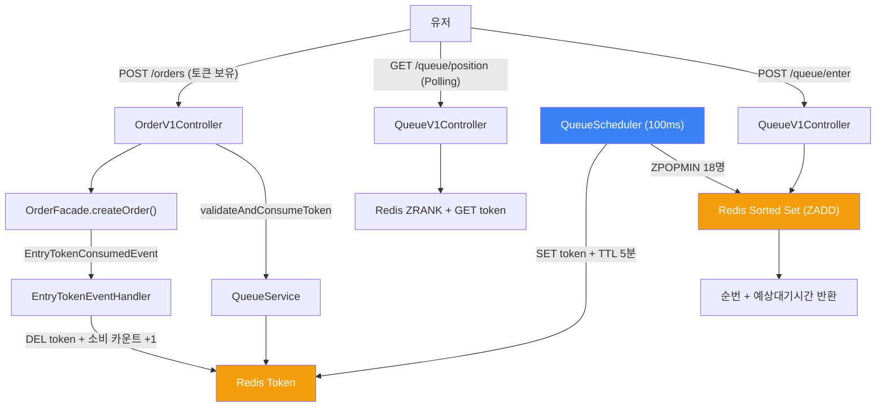

## 📌 Summary

- **배경**: 블랙프라이데이 트래픽 폭증(100 → 10,000 req/s) 시 주문 API가 직접 노출되어 DB 커넥션 고갈, 시스템 전체 장애로 이어질 수 있음
- **목표**: Redis 기반 대기열로 주문 API 앞단에 관문을 두고, 서버가 처리 가능한 속도로만 유저를 입장시켜 시스템을 보호하면서 공정한 대기 경험 제공
- **결과**: 대기열 시스템 구현(Step 1~4) + k6 부하 테스트(Step 5) + Nice-to-Have 3종(동적 Polling, Jitter, Graceful Degradation) 적용

## 🧭 Context & Decision

### 문제 정의

- **현재 동작**: 주문 API(POST /api/v1/orders)가 인증만 통과하면 누구나 즉시 호출 가능
- **문제**: 트래픽 폭증 시 DB 커넥션 풀 고갈 → 주문뿐 아니라 조회/좋아요 등 전체 API 장애로 전파
- **성공 기준**: 대기열로 초당 입장 인원을 TPS 기준으로 제한, 순번 기반 공정한 대기, 토큰 없이 주문 API 호출 시 403 차단

### 선택지와 결정

#### 1. Redis Sorted Set 기반 대기열 구조

- **A**: RDB 큐 (MySQL 테이블에 INSERT → SELECT FOR UPDATE로 순차 처리)
- **B**: Redis List (LPUSH/RPOP으로 FIFO 큐)
- **C**: Redis Sorted Set (ZADD + score=timestamp로 순서 보장)
- **결정**: C
- **근거**: Sorted Set은 대기열의 핵심 요구사항을 단일 자료구조로 해결함
  - `ZADD NX`: 같은 member(userId)가 이미 존재하면 추가하지 않음 → 중복 진입 방지가 자료구조 수준에서 보장됨
  - `ZRANK`: O(log N)으로 순번 조회 → 1만 명 대기열에서도 수 마이크로초
  - `ZPOPMIN N`: 점수가 낮은(먼저 진입한) N명을 원자적으로 꺼냄 → 스케줄러 배치 발급에 적합
  - `ZCARD`: O(1)으로 총 대기 인원 조회
- **RDB 큐 기각 이유**: 순번 조회마다 `SELECT COUNT(*) WHERE score < ?` 필요 → 대기 인원 증가 시 성능 저하. 또한 주문 트랜잭션과 같은 DB를 공유하면 대기열 부하가 주문에 영향
- **Redis List 기각 이유**: LPOS(순번 조회)가 O(N), 중복 진입 방지를 위해 별도 Set 필요 → 자료구조 2개를 동기화해야 함
- **트레이드오프**: Redis 휘발성으로 장애 시 대기열 유실 가능. 단, 대기열은 일시적 상태이므로 영속성보다 속도가 우선. 장애 시 Graceful Degradation(BLOCK/BYPASS)으로 대응

#### 2. 스케줄러 토큰 발급 + Polling 조회 구조

전체 흐름은 "스케줄러가 토큰을 발급하고, 클라이언트가 Polling으로 확인한 뒤, 토큰을 가지고 주문 API를 호출"하는 구조다.

##### 토큰 발급 주체 — 스케줄러(서버 주도) 발급

- **A**: 클라이언트가 "토큰 발급 요청" API를 호출하면 즉시 발급 (클라이언트 주도)
- **B**: 스케줄러가 100ms마다 대기열에서 18명을 꺼내 토큰을 발급 (서버 주도)
- **결정**: B
- **근거**: 서버가 처리량(TPS)에 맞춰 발급 속도를 직접 제어한다. 클라이언트 주도면 "토큰 발급 요청" 자체가 트래픽이 되어, 대기열이 보호해야 할 부하가 대기열 내부에서 다시 발생함. 스케줄러 방식은 유입량과 무관하게 일정한 속도(초당 ~180명)로만 토큰을 발급하므로 시스템 보호 목적에 부합
- **구현**: `QueueScheduler` — `@Scheduled(fixedRate = 100)`, `BATCH_SIZE = 18`
- **배치 크기 산출**: 175 TPS / 10 batches per sec ≈ 18명

##### 순번 확인 — Polling 방식

- **A**: Polling (클라이언트가 주기적으로 GET /queue/position 호출)
- **B**: SSE (서버가 순번 변동 시 Push)
- **C**: WebSocket (양방향 연결)
- **결정**: A
- **근거**: Redis `ZRANK`가 O(log N)으로 부하가 낮아 Polling 요청이 서버에 큰 부담이 되지 않음. SSE는 연결을 유지해야 하므로 1만 명이 대기하면 1만 개의 커넥션이 열려있어야 함. Polling은 요청-응답 후 커넥션이 반환되므로 서버 리소스 효율적
- **동적 Polling 주기**: 순번이 가까울수록 자주 조회 (1~100: 1초, 100~1000: 3초, 1000+: 5초) → `nextPollAfterMs` 필드로 클라이언트에 전달
- **트레이드오프**: SSE보다 실시간성이 떨어지지만, 대기열은 초 단위 갱신이면 충분. SSE 전환이 필요해지면 Nice-to-Have로 추후 적용 가능

##### 토큰 생명주기 — TTL, 검증, 소비

**TTL 5분**:
- 토큰 발급 후 주문하지 않는 유저가 토큰을 점유하면, 뒤의 유저가 영원히 입장 불가. Redis TTL로 5분 후 자동 회수하여 자원 점유를 방지
- Token Expiry Rate = (발급 수 - 소비 수) / 발급 수 → 만료율이 30%를 넘으면 TTL 연장 또는 UX 개선 필요 신호

#### 3. 예상 대기시간 산출 방법

- **산출 과정**:
  1. DB 커넥션 풀: 50 (HikariCP 설정)
  2. 주문 1건 평균 처리 시간: 200ms (가정)
  3. 이론적 최대 TPS: 50 / 0.2 = 250 TPS
  4. 안전 마진 70%: **175 TPS**
- **공식**: `estimatedWaitSeconds = position / 175`
- **스케줄러 매칭**: 100ms × 18명 = 초당 ~180명 발급 → 175 TPS와 정렬
- **k6 실측과의 괴리**: 이론 175 TPS vs 실측 10.7 TPS — 로컬 환경에서 HikariCP 기본값(10)과 실제 주문 처리 1,298ms가 원인. 보정 방향은 5번에서 상세 기술

#### 4. Thundering Herd 완화 전략

같은 배치(18명)가 동시에 주문 API를 호출하면 순간적으로 DB 커넥션이 몰리는 Thundering Herd가 발생한다. 3가지 전략으로 완화한다.

**스케줄러 배치 분산**:
- 1초에 175명을 한 번에 보내지 않고, 100ms마다 18명씩 10회로 분산 → 피크 부하를 10배 평탄화
- `QueueScheduler` — `@Scheduled(fixedRate = 100)`, `BATCH_SIZE = 18`

**Jitter (토큰 활성화 시점 분산)**:
- 토큰이 발급되면 `activateAfterMs` 필드에 0~2초 랜덤 딜레이를 포함하여 응답
- 같은 배치 18명이 정확히 같은 시점에 주문하지 않고, 0~2초에 걸쳐 자연스럽게 분산
- `QueueService.generateJitter()` — `ThreadLocalRandom.current().nextLong(0, 2001)`

**동적 Polling 주기**:
- 순번이 멀면 느리게 조회, 가까우면 빠르게 조회 → Polling 자체의 서버 부하 감소
- - 1 ~ 100 : 1초 | 100 ~ 1000 : 3초 | 1000 + : 5초 | → `nextPollAfterMs` 필드로 전달
- `QueueService.calculateNextPollInterval()`

#### 5. k6 부하 테스트 실측 및 10,000 req/s 예측 분석

##### k6 시나리오 구성

> k6 테스트는 로컬 환경 제약(단일 머신)으로 1,000 VU 기준으로 수행.

| 시나리오 | VU | 동작 | 목적 |
|---------|-----|------|------|
| blackfriday_enter | 1,000 | 5초 ramp-up → 30초 유지 → 5초 ramp-down | 대기열 진입 대량 부하 |
| full_flow | 100 | 진입 → Polling → 토큰 대기 → 주문 | 실제 유저 경험 시뮬레이션 |
| spike | 1,000 | 1초 만에 1,000명 폭증 → 10초 유지 | 스파이크 안정성 |

##### 실측 결과 (1000 VU)

| 항목 | 이론값 | 실측값 |
|------|--------|--------|
| DB 커넥션 풀 | 50 | 10 (HikariCP 기본값) |
| 주문 처리 시간 | 200ms | 1,298ms (avg) |
| 주문 TPS | 175 | 10.7 (order_success_rate 기준) |
| 주문 P95 | - | 1,700ms |
| 대기열 진입 P95 | - | 8,798ms |
| Polling P95 | - | 8,829ms |
| 주문 에러율 | - | 0% |
| 주문 성공 건수 | - | 2,238건 |
| 토큰 대기 시간 avg | - | 585ms |

##### 괴리 원인

1. **커넥션 풀 미조정**: 이론값은 50개 기준이지만, 로컬 HikariCP 기본값은 10 → TPS 상한이 이론의 1/5
2. **주문 처리 실측**: 재고 비관적 락 + 결제 연동 + 쿠폰 적용 등으로 200ms가 아닌 1,298ms
3. **대기열/Polling 지연**: 주문 처리가 느려지면서 전체 시스템 응답이 밀림. 대기열 자체(Redis)는 빠르지만 Tomcat 스레드가 주문에 점유되어 대기열 API까지 영향

##### 10,000 req/s 예측 분석

과제 시나리오(블랙프라이데이 100 → 10,000 req/s)에서 대기열 시스템이 어떻게 동작하는지 실측 데이터 기반으로 예측한다.

**핵심 전제: 10,000 req/s는 대기열 진입 트래픽이고, 주문 TPS는 DB 용량으로 결정된다.**

유입량이 1,000이든 10,000이든, 스케줄러는 DB가 처리 가능한 속도로만 토큰을 발급한다. 대기열은 유입량을 흡수하는 버퍼이므로, 유입량이 늘어도 TPS는 변하지 않고 대기열 길이와 대기 시간만 증가한다.

**대기열 진입 처리 (Redis)**:
- Redis Sorted Set `ZADD`: 단일 인스턴스 기준 10만+ ops/s 처리 가능
- 10,000 req/s는 Redis 관점에서 여유 있는 수준

**주문 TPS (DB 제약)**:

| 환경 | 커넥션 풀 | 처리 시간 | TPS | 근거 |
|------|----------|----------|-----|------|
| 현재 (로컬) | 10 | 1,298ms | 10.7 | k6 실측 |
| 설정 보정 후 | 50 | 200ms | 175 | 이론값 (커넥션 풀 명시 + 처리 최적화) |
| 스케일아웃 2대 | 50 × 2 | 200ms | 350 | 인스턴스 병렬 |

**10,000 req/s 유입 시 대기열 예측**:

| 환경 | TPS | 초당 누적 | 30초 후 대기 인원 | 예상 대기시간 |
|------|-----|----------|-----------------|-------------|
| 현재 (TPS 10.7) | 10.7 | ~9,989명/s | ~299,670명 | ~7.8시간 |
| 보정 후 (TPS 175) | 175 | ~9,825명/s | ~294,750명 | ~28분 |
| 스케일아웃 (TPS 350) | 350 | ~9,650명/s | ~289,500명 | ~14분 |

**분석**:
- 10,000 req/s 트래픽은 어떤 설정에서도 TPS를 크게 초과하므로, 대기열 누적은 불가피
- 핵심은 TPS를 높여 대기 시간을 줄이는 것: TPS 175(28분) vs TPS 350(14분)
- Redis는 10,000 ZADD/s를 충분히 처리 가능하므로, 대기열 진입 자체는 병목이 아님
- Tomcat 스레드 격리가 되면 대기열 API 응답은 수 ms 수준으로 유지 가능

##### TPS 향상을 위한 보정 방향

| 보정 항목 | 현재 | 목표 | 변경 |
|-----------|------|------|------|
| 커넥션 풀 | 10 | 100 | HikariCP maximumPoolSize 조정 |
| 주문 처리시간 | 1,298ms | 200ms 이하 | 쿼리 최적화, 락 범위 축소, 결제 비동기화 |
| 배치 크기 | 18 | TPS에 비례 조정 | 목표 TPS / 10 batches |
| 인스턴스 | 1대 | N대 | 수평 확장 + 스케줄러 리더 선출 (단일 스케줄러만 토큰 발급) |
| Tomcat 스레드 | 200 | 대기열 전용 분리 | 대기열 API와 주문 API의 스레드 풀 격리 |

## 🏗️ Design Overview

### 변경 범위

- **영향 모듈**: commerce-api (대기열 전 레이어 + Nice-to-Have)
- **신규 추가**: ~15파일 (Repository, Service, DTO, Controller, ApiSpec, Scheduler, Event, Properties, 테스트 3종)
- **변경**: OrderV1Controller (토큰 검증), OrderFacade (토큰 소비 이벤트), application.yml (스케줄러 + Fallback 설정)

### 주요 컴포넌트 책임

| 컴포넌트 | 레이어 | 역할 |
|----------|--------|------|
| `WaitingQueueRedisRepository` | infrastructure | Redis Sorted Set CRUD, 토큰 저장/삭제 |
| `QueueService` | application | 대기열 진입/순번 조회/토큰 검증, Fallback 전략 분기 |
| `QueueScheduler` | infrastructure | 100ms 주기 배치 토큰 발급 (ConditionalOnProperty) |
| `QueueProperties` | application | fallbackStrategy 외부 설정 바인딩 |
| `EntryTokenEventHandler` | application | AFTER_COMMIT + @Async로 토큰 삭제 + 소비 카운트 |
| `QueueV1Controller` | interfaces | POST /queue/enter, GET /queue/position |
| `QueueV1ApiSpec` | interfaces | Swagger 어노테이션 분리 |

## 🔁 Flow Diagram

### 대기열 진입 → 토큰 발급 → 주문

## 📋 테스트

| 테스트 | 파일 | 검증 |
|--------|------|------|
| QueueServiceTest | 단위 (Mockito) | 대기열 진입, 순번 조회, 토큰 검증, 지표 계산, BLOCK/BYPASS Fallback |
| QueueServiceIntegrationTest | 통합 (Testcontainers) | 실제 Redis 진입 → 토큰 발급 → 검증, 배치 처리, 중복 진입 순번 유지 |
| QueueV1ApiE2ETest | E2E (TestRestTemplate) | HTTP 진입/순번 API, 토큰 발급 후 주문 성공, 토큰 없이 주문 403 |
| OrderV1ApiE2ETest | E2E (수정) | Redis 토큰 키 정리 추가 (테스트 격리) |
| PaymentV1ApiE2ETest | E2E (수정) | Redis 대기열 키 정리 추가 |
| k6 queue-load-test.js | 부하 테스트 | 1000 VU 대기열 진입, 전체 흐름, 스파이크 안정성 |
