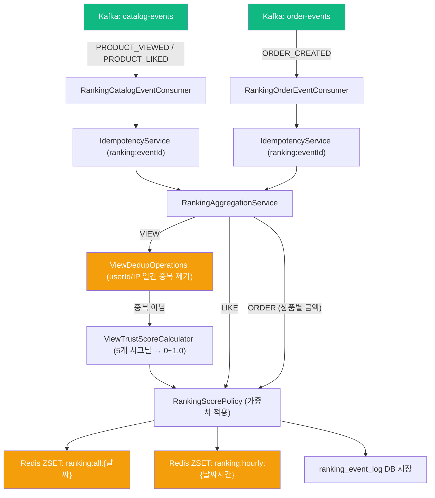
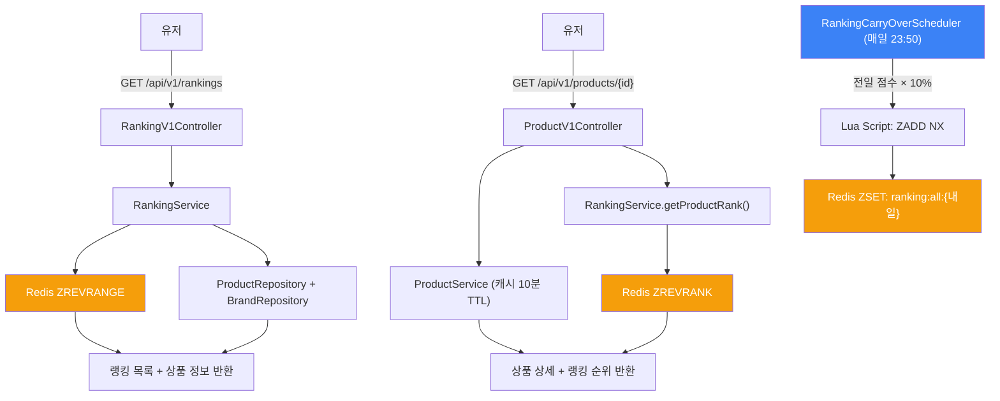

## 📌 Summary

- 배경: Round 7의 Kafka 파이프라인이 수집한 유저 행동 이벤트를 기반으로, Redis ZSET에 실시간 랭킹을 반영하고 API로 제공한다.
- 목표: 조회/좋아요/주문 이벤트 → ZSET 점수 적재 → 랭킹 API 제공, 조회수 어뷰징 방지까지 구현한다.
- 결과: 별도 Consumer Group으로 ZSET 적재, 랭킹 API + 상품 상세 rank 추가, 2계층 어뷰징 방지(중복 제거 + Trust Score). k6 테스트에서 봇 100회 조회가 정상 유저 50명의 1.4%로 억제됨.


## 🧭 Context & Decision

### 핵심 설계 결정

| # | 결정 | 선택 | 근거 |
|---|------|------|------|
| 1 | Metrics vs Ranking 결합 방식 | **별도 Consumer Group 분리** | Kafka를 쓰는 이유(결합도 감소)와 일관성 유지. 한쪽 장애가 다른 쪽에 영향 없음 |
| 2 | 상품 상세 + 랭킹 캐시 전략 | **Controller 레벨 조합** | 기존 ProductCacheService(10분 TTL) 무변경. 랭킹은 실시간이라 캐시에 넣으면 stale |
| 3 | 조회수 어뷰징 방지 | **2계층: 중복 제거 + Trust Score** | 차단(이진적)이 아닌 신뢰도(연속적) 접근. 진짜 트래픽을 해치지 않으면서 봇 억제 |


## 🏗️ Design Overview

### 전체 아키텍처

```
[유저 행동] → commerce-api → Kafka
                                ├── metrics-consumer (기존) → product_metrics DB
                                └── ranking-consumer (신규) → Redis ZSET + 어뷰징 검증
              
[랭킹 조회] → GET /api/v1/rankings → Redis ZREVRANGE → 상품 정보 Aggregation
[상품 상세] → GET /api/v1/products/{id} → ProductService(캐시) + RankingService(Redis) 조합
```

### 변경 범위

| 구분 | 파일 수 | 내용 |
|------|---------|------|
| commerce-streamer 프로덕션 | 16개 | ZSET 적재, Consumer, 어뷰징 방지, 동적 가중치, 이벤트 로그 |
| commerce-api 프로덕션 | 12개 | 랭킹 API, 상품 상세 rank 추가, 이벤트 enrichment |
| 테스트 | 10개 | 단위 테스트, TrustScore 테스트 |
| k6 | 3개 | 어뷰징 방지 테스트 시나리오 |

---

### 1. 별도 Consumer Group으로 이벤트 파이프라인 분리

같은 토픽을 2개 consumer-group이 독립 소비. Metrics 장애가 Ranking에 영향을 주지 않는 구조.

```
catalog-events / order-events 토픽
  ├── metrics-consumer (기존) → product_metrics DB 적재
  └── ranking-consumer (신규) → Redis ZSET ZINCRBY + 어뷰징 검증
```

> [`RankingCatalogEventConsumer.kt#L24-L28`][RankingCatalogConsumer]

멱등성도 독립 관리. 같은 `event_handled` 테이블을 공유하되 `"ranking:"` prefix로 eventId 충돌을 방지.

> [`RankingCatalogEventConsumer.kt#L78`][RankingEventIdPrefix]

```kotlin
val rankingEventId = "ranking:${message.eventId}"  // metrics의 eventId와 분리
if (idempotencyService.isAlreadyHandled(rankingEventId)) continue
```

---

### 2. 캐시 데이터와 실시간 데이터의 조합 전략

상품 상세에 랭킹 순위를 추가해야 하는데, 기존 `ProductCacheService`는 10분 TTL로 캐싱 중. 랭킹은 실시간으로 변하므로 캐시에 함께 넣으면 stale한 순위가 10분간 노출됨.

**Controller에서 두 데이터를 각각 조회 후 조합**하여 기존 캐시 구조를 전혀 건드리지 않음.

> [`ProductV1Controller.kt#L50-L52`][ProductV1Controller]

```kotlin
val productInfo = productService.getProductInfo(productId)  // 캐시 or DB
val rank = rankingService.getProductRank(productId, LocalDate.now())  // Redis O(logN)
return ProductDetailResponse.from(productInfo, rank)
```

---

### 3. 콜드 스타트 해결 — Lua 스크립트 기반 Score Carry-Over

매일 자정에 ZSET 키가 바뀌면 모든 상품 점수가 0. 23:50 스케줄러가 전일 점수의 10%를 다음 날 키에 복사.

**`ZADD NX`로 기존 점수 보호**: 이미 오늘 점수가 쌓인 상품은 carry-over로 덮어쓰지 않음.

> [`RankingRedisRepository.kt#L59-L77`][CarryOverScript]

```lua
-- Lua 스크립트 (원자적 실행)
local members = redis.call('ZRANGEBYSCORE', sourceKey, '-inf', '+inf', 'WITHSCORES')
for i = 1, #members, 2 do
    local score = tonumber(members[i + 1]) * weight
    redis.call('ZADD', targetKey, 'NX', score, members[i])  -- NX: 없는 멤버만 추가
end
redis.call('EXPIRE', targetKey, ttl)
```

---

### 4. 조회수 어뷰징 방지 — 2계층 방어

> 리뷰 포인트: 이 접근이 과한지, 아니면 Layer 1만으로 충분한지 의견 부탁드립니다.

#### 왜 조회수가 위험한가

좋아요는 로그인, 주문은 결제가 필요하지만 조회는 **GET 요청 하나면 끝**. 인증 불필요. 봇이 1만 번 조회하면 `10,000 × 0.1 = 1,000점`으로 좋아요 5,000건과 동급이 됨.

#### 검토하고 버린 전략들

| 전략 | 버린 이유 |
|------|----------|
| 상품 단위 감쇠 (시간당 cap) | 이벤트/세일로 진짜 트래픽이 몰려도 감쇠됨 — 정상과 봇을 구분 불가 |
| User-Agent 필터 | 문자열 하나 바꾸면 위조 가능 |
| 후속 행동 기반 가중치 | 구현 복잡도 높고 실시간 반영 어려움 |

핵심 문제: **모든 "차단" 전략이 진짜 트래픽도 해칠 수 있다.** 그래서 차단(이진적)이 아닌 **신뢰도(연속적)** 접근으로 전환.

#### Layer 1: userId/IP 일간 중복 제거

같은 식별자 + 같은 상품 → 하루 1회만 점수 반영. **userId 우선, 없으면 IP 기준.**

> [`ViewDedupRedisRepository.kt#L28-L33`][ViewDedupBuildKey] / [`RankingAggregationService.kt#L36`][DedupCheck]

```kotlin
// 로그인:   ranking:view:dedup:{날짜}:{상품}:user:{loginId}  → IP 무시
// 비로그인: ranking:view:dedup:{날짜}:{상품}:ip:{clientIp}
```

같은 회사 와이파이에서 로그인 유저 10명이 보면 10명 다 반영. 같은 유저가 IP를 바꿔도(회사 → 집) userId 기준이라 1회만 반영.

#### Layer 2: Trust Score — 5개 시그널로 점수 차등

Layer 1을 통과한 조회에 대해 **0~1.0 신뢰도**를 계산해 기본 점수에 곱함. 차단이 아닌 **감쇠**.

> [`ViewTrustScoreCalculator.kt#L5-L16`][TrustScoreCalc] / [`RankingAggregationService.kt#L41-L43`][TrustScoreApply]

| 시그널 | 정상 | 의심 | 점수 |
|--------|------|------|------|
| 로그인 여부 | 로그인 | guest | 0.3 vs 0.05 |
| User-Agent | 있음 | 없음 | 0.1 vs 0 |
| Referer | 있음 | 없음 | 0.1 vs 0 |
| 분당 요청 수 | 1~3회 | 10+ | 0.3 vs 0 |
| 10분 내 상품 다양성 | 3개+ | 1개만 | 0.2 vs 0 |

**최종 점수** = `기본 조회 점수(0.1) × Trust Score`

| 유저 유형 | Trust Score | 최종 점수 | 정상 대비 |
|----------|-------------|----------|----------|
| 정상 로그인 | 1.0 | 0.1 | 100% |
| 정상 비로그인 | 0.75 | 0.075 | 75% |
| 의심 봇 | 0.05 | 0.005 | **5%** |

**왜 진짜 트래픽을 해치지 않는가**: 이벤트로 정상 유저가 몰려도 로그인 + UA + Referer가 있으니 Trust Score 1.0. 봇은 여러 시그널에서 동시에 낮은 점수 — 하나만 위조해선 다른 시그널에서 걸림.

---

### 5. k6 어뷰징 방지 효과 검증

10배 스케일 테스트 결과:

```
1위: 상품1 (score: 4.0000) ← 정상 유저 50명
2위: 상품2 (score: 0.0550) ← 단일IP 봇 100회 (정상의 1.4%)
3위: 상품3 (score: 0.0450) ← UA없는 봇 50개 (정상의 1.1%)
```

| 상품 | 시나리오 | 요청 수 | 점수 | 정상 대비 |
|------|---------|--------|------|----------|
| 상품1 | 정상 로그인 50명 | 100회 | **4.0000** | 100% |
| 상품2 | 단일 IP 봇 | 100회 | 0.0550 | **1.4%** |
| 상품3 | UA없는 봇 50개 | 50회 | 0.0450 | **1.1%** |

핵심: 봇 점수는 Layer 1에서 1회로 **고정**, 정상 유저 점수는 인원에 비례해 **선형 증가**. 유저가 늘어날수록 봇 영향력은 더 줄어든다.


## 🔁 Flow Diagram

### 이벤트 → ZSET 적재 (어뷰징 방지 포함)



### 랭킹 조회 + 콜드 스타트




## ✅ 과제 체크리스트

### Must-Have

| 구분 | 요건 | 충족 |
|------|------|:----:|
| **Ranking Consumer** | ZSET TTL, 키 전략 적절 구성 | ✅ |
| | 날짜별 키 계산 (`ranking:all:{yyyyMMdd}`) | ✅ |
| | 이벤트 → ZSET 점수 적절 반영 | ✅ |
| **Ranking API** | 랭킹 Page 조회 정상 반환 | ✅ |
| | 상품 정보 Aggregation 포함 | ✅ |
| | 상품 상세에 순위 반환 (null 처리) | ✅ |
| **검증** | 이벤트 → ZSET → API 조회 E2E | ✅ |
| | 일자 변경 시 이전 랭킹 조회 정상 | ✅ |
| | 가중치 반영 검증 | ✅ |

### Nice-to-Have

| 구분 | 요건 | 충족 |
|------|------|:----:|
| **시간 단위 랭킹** | `ranking:hourly:{yyyyMMddHH}` TTL 3시간 | ✅ |
| **콜드 스타트** | 23:50 스케줄러 Score Carry-Over (전일 10%) | ✅ |

### 추가 구현

| 구분 | 내용 | 충족 |
|------|------|:----:|
| **어뷰징 방지** | Layer 1 중복 제거 + Layer 2 Trust Score | ✅ |
| **동적 가중치** | DB 기반 가중치 관리 + 5분 캐싱 + 폴백 | ✅ |
| **이벤트 로그** | ranking_event_log DB 저장 (스코어 리플레이 기반) | ✅ |
| **멱등성** | IdempotencyService + "ranking:" prefix | ✅ |
| **DIP** | domain 인터페이스 3개 분리 | ✅ |
| **k6 테스트** | 어뷰징 방지 효과 검증 (1x, 10x) | ✅ |


<!-- GitHub 코드 링크 -->

[RankingCatalogConsumer]: https://github.com/YoonbeomSo/loop-pack-be-l2-vol3-kotlin/blob/feat/round9-show-me-the-ranking/apps/commerce-streamer/src/main/kotlin/com/loopers/interfaces/consumer/RankingCatalogEventConsumer.kt#L24-L28
[RankingEventIdPrefix]: https://github.com/YoonbeomSo/loop-pack-be-l2-vol3-kotlin/blob/feat/round9-show-me-the-ranking/apps/commerce-streamer/src/main/kotlin/com/loopers/interfaces/consumer/RankingCatalogEventConsumer.kt#L78
[ProductV1Controller]: https://github.com/YoonbeomSo/loop-pack-be-l2-vol3-kotlin/blob/feat/round9-show-me-the-ranking/apps/commerce-api/src/main/kotlin/com/loopers/interfaces/api/product/ProductV1Controller.kt#L50-L52
[CarryOverScript]: https://github.com/YoonbeomSo/loop-pack-be-l2-vol3-kotlin/blob/feat/round9-show-me-the-ranking/apps/commerce-streamer/src/main/kotlin/com/loopers/infrastructure/ranking/RankingRedisRepository.kt#L59-L77
[ViewDedupBuildKey]: https://github.com/YoonbeomSo/loop-pack-be-l2-vol3-kotlin/blob/feat/round9-show-me-the-ranking/apps/commerce-streamer/src/main/kotlin/com/loopers/infrastructure/ranking/ViewDedupRedisRepository.kt#L28-L33
[DedupCheck]: https://github.com/YoonbeomSo/loop-pack-be-l2-vol3-kotlin/blob/feat/round9-show-me-the-ranking/apps/commerce-streamer/src/main/kotlin/com/loopers/application/ranking/RankingAggregationService.kt#L36
[TrustScoreCalc]: https://github.com/YoonbeomSo/loop-pack-be-l2-vol3-kotlin/blob/feat/round9-show-me-the-ranking/apps/commerce-streamer/src/main/kotlin/com/loopers/domain/ranking/ViewTrustScoreCalculator.kt#L5-L16
[TrustScoreApply]: https://github.com/YoonbeomSo/loop-pack-be-l2-vol3-kotlin/blob/feat/round9-show-me-the-ranking/apps/commerce-streamer/src/main/kotlin/com/loopers/application/ranking/RankingAggregationService.kt#L41-L43
